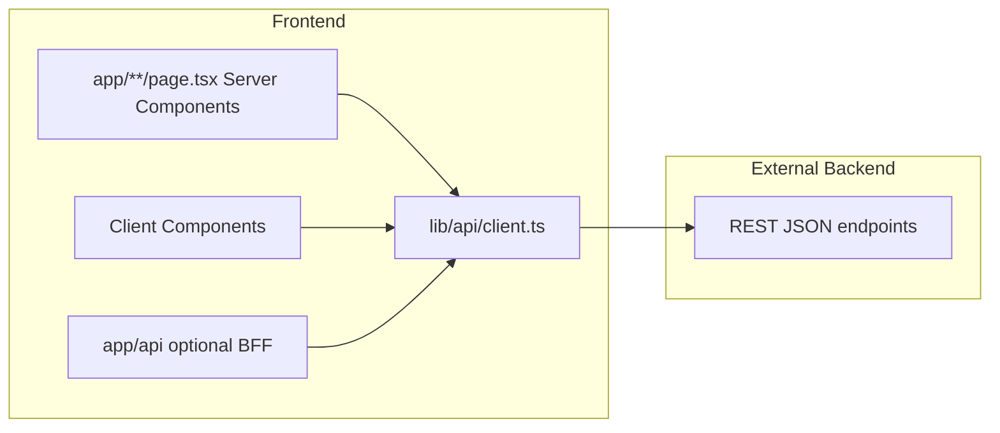

# NIP Reality Frontend — Architecture

Reference source: `c:\laragon\www\website` (Nour Attorneys). NIP adapts **structure and patterns**, not Prisma/in-app DB.

## Stack

| Layer | Choice |
|-------|--------|
| Framework | Next.js 16 App Router |
| UI | React 19, TypeScript |
| Styling | Tailwind CSS v4 (Figma → utility classes) |
| Data | **External backend REST API** via `lib/api/client.ts` |
| Package manager | npm |

## Folder structure

```
├── app/                    # Routes (page.tsx, layout.tsx, route handlers)
│   └── api/                # Optional BFF proxies to backend (when needed)
├── components/             # Shared UI; hooks co-located here
├── lib/
│   └── api/                # apiFetch, endpoint helpers
├── server/                 # Server-only helpers (no DB)
├── types/                  # Shared TypeScript types
└── public/                 # Static assets
```

Path alias: `@/*` → project root (create-next-app default).

## Data flow (API-backed)



### Rules

- **Never** add Prisma or direct DB access in Next.js.
- Reads: Server Components call `apiFetch()` or dedicated helpers in `lib/api/`.
- Writes: `POST`/`PUT`/`DELETE` to backend; then `router.refresh()` for SSR updates.
- Env: `NEXT_PUBLIC_API_URL` in `.env.local` (see `.env.example`).

## Rendering model

- **Default:** Server Components in `app/**/page.tsx`.
- **Client:** `"use client"` only for interactivity, forms, editable CMS UI, browser APIs.
- **After mutations:** `router.refresh()` so server pages re-fetch from backend.

## Editable page sections (CMS blocks)

Reference project makes every page section editable via **blocks** keyed by `(relUrl, blockKey)`.

See [EDITABLE-BLOCKS.md](./EDITABLE-BLOCKS.md) for the full pattern and NIP backend mapping.

Summary:

| Reference (website) | NIP Reality |
|---------------------|-------------|
| `getBlocksForPage()` → Prisma | `GET /blocks?relUrl=` → backend API |
| `POST /api/blocks` → Prisma upsert | `POST /blocks` → backend API |
| `revalidateTag` + cache | Backend response + `router.refresh()` |
| `EditableText` / `EditableImage` | Same component pattern; swap data source |

## Page composition pattern (from reference)

1. Define `const relUrl = "/your-page-path"` in the page.
2. Wrap each editable copy/media slot with `EditableText` or `EditableImage` + stable `blockKey`.
3. Use **placeholder** content in JSX until backend has saved content.
4. Static layout/sections: regular components in `components/`.

Example (conceptual):

```tsx
// app/about/page.tsx
const relUrl = "/about";

export default async function AboutPage() {
  return (
    <section>
      <EditableText
        relUrl={relUrl}
        blockKey="hero-title"
        placeholderContent="About NIP Reality"
        placeholderTag="h1"
        className="text-4xl font-bold"
      />
    </section>
  );
}
```

## Auth (admin editing)

Reference uses JWT cookie + `admin=1` cookie for inline edit UI.

NIP: auth tokens/cookies come from **backend**. Client hook `useIsAdmin()` checks admin session cookie set by backend login. Middleware in Next.js optional for `/admin/*` routes only.

## Figma → frontend

1. Break Figma frames into **sections** → `components/` or page sections.
2. Map spacing/colors/type to Tailwind utilities and `app/globals.css` `@theme` tokens.
3. Build static layout first; add `EditableText`/`EditableImage` where content must be CMS-editable.
4. Wire dynamic lists (team, services) to backend list endpoints.

## Quality gate

```bash
npm run check   # eslint + tsc
npm run build   # production build
```

## Phase roadmap

| Phase | Status |
|-------|--------|
| Init + folder structure | Done |
| Docs + Cursor config | Done |
| Backend API contract for blocks | TBD with backend team |
| Editable components implementation | TBD |
| Figma page builds | Ongoing |
