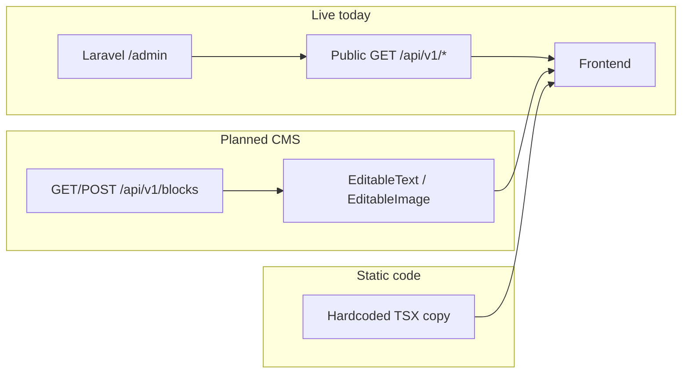

# NIP Reality — Backend API Specification

Complete backend specification for the NIP Reality platform: database schemas, API contracts, and **where content editors change what appears on the site**.

**Version:** 1.1  
**Last Updated:** June 2026  
**Frontend Tech:** Next.js 16, React 19, TypeScript

---

## Related documents

| Document | Audience | Purpose |
|----------|----------|---------|
| [FRONTEND-API-INTEGRATION.md](./FRONTEND-API-INTEGRATION.md) | Frontend developers / AI agents | **Live** REST contracts for the Next.js app |
| **This file** | Backend team + content editors | Full schema reference + **content editability map** (current vs target) |
| [PRIVATE-OFFICE-API-SPEC.md](./PRIVATE-OFFICE-API-SPEC.md) | Private Office | Member UX, advisor workflows, extended rules |
| [AI-CONCIERGE-SPEC.md](./AI-CONCIERGE-SPEC.md) | AI Concierge | RAG chat, Meilisearch, Claude routing, leads, admin controls |
| [EDITABLE-BLOCKS.md](./EDITABLE-BLOCKS.md) | Frontend developers | `EditableText` / `EditableImage` implementation pattern |

> **Integration note:** Catalog, forms, home bootstrap, and Private Office member endpoints are **live** on Laravel. The CMS Blocks API in this document is **planned** — the frontend is wired with `EditableText` placeholders until the backend implements `GET/POST /api/v1/blocks`.

---

## Table of Contents

1. [Content Editability Guide](#content-editability-guide)
2. [Database Schema](#database-schema)
3. [Supported Locales](#supported-locales)
4. [CMS Blocks API (planned)](#cms-blocks-api-planned)
5. [Media Upload API (planned)](#media-upload-api-planned)
6. [Authentication API](#authentication-api)
7. [Properties API](#properties-api)
8. [Developers API](#developers-api)
9. [Areas API](#areas-api)
10. [Off-Plan Projects API](#off-plan-projects-api)
11. [Insights API](#insights-api)
12. [Leads API](#leads-api)
13. [FAQ API](#faq-api)
14. [Implementation Status](#implementation-status)
15. [CMS Block Key Registry](#cms-block-key-registry)
16. [Known Gaps (current vs target)](#known-gaps-current-vs-target)
17. [Private Office API (separate doc)](#private-office-api-separate-doc)
18. [AI Concierge API (separate doc)](#ai-concierge-api-separate-doc)

---

## Content Editability Guide

This section answers: **“If I want to change something on the website, where do I edit it?”**

Each row shows **current** behaviour (what the live Next.js app does today) and **target** behaviour (what we want once all gaps are closed).

### Content source types

| Type | Where editors change it | Status |
|------|-------------------------|--------|
| **API** | Laravel `/admin` → Properties, Blogs, Areas, Developers, Members, etc. | **Live** — data flows via public `GET /api/v1/*` |
| **CMS Block** | Future blocks API; today hardcoded **placeholders** shown until a block is saved | **Frontend-ready** — `EditableText` wired; backend **not built** |
| **Static** | Requires a frontend code change | Hardcoded in React components |
| **Form** | User submissions stored as leads in admin | **Live** — not page copy |



**Matrix column legend**

| Column | Meaning |
|--------|---------|
| **Section** | UI area on the page |
| **Current** | How content is sourced today |
| **Target** | Intended long-term source |
| **Edit via (today)** | Where an editor goes *right now* |
| **API / block key** | Endpoint or CMS `(relUrl, block_key)` |
| **Frontend file** | React component implementing the section |

Block keys are defined in `lib/i18n/block-keys.ts`. CMS `relUrl` values are locale-agnostic (no `/en` prefix).

---

### Global (all pages)

| Section | Current | Target | Edit via (today) | API / block key | Frontend file |
|---------|---------|--------|------------------|-----------------|---------------|
| Footer tagline | CMS Block (placeholder) | CMS Block | Code change until blocks API live | `/global` · `footer-tagline` | `components/Footer.tsx` |
| Footer newsletter title / desc | CMS Block (placeholder) | CMS Block | Code change until blocks API live | `/global` · `footer-newsletter-title`, `footer-newsletter-desc` | `components/Footer.tsx` |
| Newsletter form | Form | Form | Admin → Newsletter subscriptions | `POST /newsletter-subscriptions` | `components/forms/InquiryForms.tsx` |
| Header nav labels | Static | Static | Code change | — | `components/Header.tsx`, `components/MobileNav.tsx` |

---

### `/` Home

| Section | Current | Target | Edit via (today) | API / block key | Frontend file |
|---------|---------|--------|------------------|-----------------|---------------|
| Hero eyebrow / title / body | CMS Block (placeholder) | CMS Block | Code change until blocks API live | `/` · `hero-eyebrow`, `hero-title`, `hero-body` | `components/sections/HomeHeroSection.tsx` |
| Hero background | Static CSS gradient | CMS Block image | Code change | `/` · `hero-image` (**key exists, unused**) | `components/sections/HomeHeroSection.tsx` |
| Featured insight cards | **API** | **API** | Admin → Blogs | `GET /blogs?per_page=3` | `app/[locale]/page.tsx` |
| Section headings (Featured Insight, Curated, Market Pulse, Featured Selection, CTA) | CMS Block (placeholder) | CMS Block | Code change until blocks API live | `/` · see [home section keys](#cms-block-key-registry) | `components/sections/*Section.tsx` via `SectionHeading` |
| Market pulse stat cards (AED figures) | **Static** | CMS Block or API stats | Code change | — | `components/sections/MarketPulseSection.tsx`, `home-data.ts` |
| Featured / curated property grids | **API** | **API** | Admin → Properties (mark featured) | `GET /home` → `featured_properties` | `app/[locale]/page.tsx` |
| Featured area cards (below stats) | **API** | **API** | Admin → Areas (featured) | `GET /home` → `areas` | `components/sections/MarketPulseSection.tsx` |
| “Featured Areas” sub-heading | **Static** | CMS Block | Code change | — (no block key yet) | `components/sections/MarketPulseSection.tsx` |
| Private Office band title / desc | CMS Block (placeholder) | CMS Block | Code change until blocks API live | `/` · `private-office-title`, `private-office-desc` | `components/sections/PrivateOfficeSection.tsx` |
| CTA button labels | Static | CMS Block (optional) | Code change | — | `components/sections/HomeCtaSection.tsx` |

---

### `/properties` and `/off-plan` (list)

| Section | Current | Target | Edit via (today) | API / block key | Frontend file |
|---------|---------|--------|------------------|-----------------|---------------|
| List hero (eyebrow, title, description) | **Static** | CMS Block | Code change | `/properties` or `/off-plan` · `hero-*` (**keys exist, unused**) | `app/[locale]/properties/page.tsx`, `off-plan/page.tsx` |
| Filter bar + results grid | **API** | **API** | Admin → Properties | `GET /properties?{filters}` | `components/catalog/PropertyListingPage.tsx` |
| Pagination | **API** | **API** | — | `meta.current_page`, `meta.last_page` | `components/ui/ApiPagination.tsx` |

---

### `/properties/[slug]` and `/off-plan/[slug]` (detail)

| Section | Current | Target | Edit via (today) | API / block key | Frontend file |
|---------|---------|--------|------------------|-----------------|---------------|
| Title, price, location, gallery, description, facilities | **API** | **API** | Admin → Properties | `GET /properties/{slug}` | `components/catalog/PropertyDetailPage.tsx` |
| Similar listings | **API** | **API** | Admin → Properties | `GET /properties/{slug}/similar` | `components/catalog/PropertyDetailPage.tsx` |
| Property inquiry form | Form | Form | Admin → Property inquiries | `POST /property-inquiries` | `components/forms/InquiryForms.tsx` |
| “Request Private Advisory” CTA copy | Static | CMS Block (optional) | Code change | — | `components/catalog/PropertyDetailPage.tsx` |

---

### `/areas` and `/areas/[slug]`

| Section | Current | Target | Edit via (today) | API / block key | Frontend file |
|---------|---------|--------|------------------|-----------------|---------------|
| List hero | **Static** | CMS Block | Code change | `/areas` · `hero-*` (**keys exist, unused**) | `app/[locale]/areas/page.tsx` |
| Area cards | **API** | **API** | Admin → Areas | `GET /areas` | `app/[locale]/areas/page.tsx` |
| Detail hero (name, description) | **API** | **API** | Admin → Areas | `GET /areas/{slug}` | `app/[locale]/areas/[slug]/page.tsx` |
| Listings in area | **API** | **API** | Admin → Properties | `GET /properties?area={slug}` | `app/[locale]/areas/[slug]/page.tsx` |

---

### `/developers` and `/developers/[slug]`

| Section | Current | Target | Edit via (today) | API / block key | Frontend file |
|---------|---------|--------|------------------|-----------------|---------------|
| List hero | **Static** | CMS Block | Code change | `/developers` · `hero-*` (**keys exist, unused**) | `app/[locale]/developers/page.tsx` |
| Developer cards | **API** | **API** | Admin → Developers | `GET /developers` | `app/[locale]/developers/page.tsx` |
| Detail (bio, logo, communities, portfolio) | **API** | **API** | Admin → Developers / Properties | `GET /developers/{slug}` + `GET /properties?developer={slug}` | `app/[locale]/developers/[slug]/page.tsx` |

---

### `/insights` and `/insights/[slug]`

| Section | Current | Target | Edit via (today) | API / block key | Frontend file |
|---------|---------|--------|------------------|-----------------|---------------|
| List hero copy | **Static** | CMS Block | Code change | `/insights` · `hero-*` (**keys exist, unused**) | `app/[locale]/insights/page.tsx` |
| Category filters | **API** | **API** | Admin → Blog categories | `GET /blog-categories` | `components/ui/InsightCategoryFilters.tsx` |
| Featured + article grid | **API** | **API** | Admin → Blogs | `GET /blogs` | `app/[locale]/insights/page.tsx` |
| Article detail | **API** | **API** | Admin → Blogs | `GET /blogs/{slug}` | `app/[locale]/insights/[slug]/page.tsx` |

---

### `/about`

| Section | Current | Target | Edit via (today) | API / block key | Frontend file |
|---------|---------|--------|------------------|-----------------|---------------|
| Hero, market, role, partners, standard sections | **Static** | CMS Block | Code change | `/about` · `hero-*` (**keys exist, unused**) | `components/sections/AboutStorySections.tsx` |

---

### `/contact`

| Section | Current | Target | Edit via (today) | API / block key | Frontend file |
|---------|---------|--------|------------------|-----------------|---------------|
| Hero + form intro copy | CMS Block (placeholder) | CMS Block | Code change until blocks API live | `/contact` · `hero-*`, `form-intro-*` | `components/sections/ContactStorySections.tsx` |
| Contact form | Form | Form | Admin → Contact inquiries | `POST /contact-inquiries` | `components/forms/InquiryForms.tsx` |

---

### `/faq`

| Section | Current | Target | Edit via (today) | API / block key | Frontend file |
|---------|---------|--------|------------------|-----------------|---------------|
| Hero | CMS Block (placeholder) | CMS Block | Code change until blocks API live | `/faq` · `hero-*` | `components/sections/FaqStorySections.tsx` |
| FAQ accordion Q&A | **Static** (`faqItems` array) | **API** | Code change | `GET /faqs` (**spec only — not in FRONTEND-API-INTEGRATION; verify backend**) | `components/sections/FaqStorySections.tsx` |
| CTA band (“Still Have Questions?”) | **Static** | CMS Block | Code change | `/faq` · `cta-title`, `cta-description` (**keys exist, unused**) | `components/sections/FaqStorySections.tsx` |

---

### `/concierge`, `/contribute`, `/legal`

| Page / section | Current | Target | Edit via (today) | API / block key | Frontend file |
|----------------|---------|--------|------------------|-----------------|---------------|
| Concierge hero | CMS Block (placeholder) | CMS Block | Code change until blocks API live | `/concierge` · `hero-*` | `components/sections/ConciergeStorySections.tsx` |
| Concierge chat UI, sample messages | Static | Static (product feature) | Code change | — | `components/sections/ConciergeStorySections.tsx` |
| Contribute hero + sidebar | CMS Block (placeholder) | CMS Block | Code change until blocks API live | `/contribute` · `hero-*`, `sidebar-title` | `components/sections/ContributeStorySections.tsx` |
| Contribute form | Static (no submit) | Form endpoint TBD | Code change | — | `components/ui/LeadForms.tsx` |
| Legal hero + policy sections | **Static** (`legalSections` array) | CMS Block or admin legal pages | Code change | `/legal` · `hero-*` (**keys exist, unused**) | `components/sections/LegalStorySections.tsx` |

---

### `/private-office`, `/private-office/member`, `/curated`

| Section | Current | Target | Edit via (today) | API / block key | Frontend file |
|---------|---------|--------|------------------|-----------------|---------------|
| Login card copy | **Static** | CMS Block | Code change | `/private-office` · `login-title`, `login-description` (**keys exist, unused**) | `components/forms/PrivateOfficeLoginForm.tsx` |
| Member hero (name, advisor) | **API** | **API** | Admin → Members | `GET /auth/member/me` | `components/sections/PrivateOfficeMemberSections.tsx` |
| Curated preview / full selection | **API** | **API** | Admin/advisor → Curated selections | `GET /member/curated` | `components/catalog/MemberDashboard.tsx`, `CuratedStorySections.tsx` |
| Saved properties | **API** | **API** | Member saves / admin | `GET /member/saved` | `components/sections/PrivateOfficeMemberSections.tsx` |
| Advisor notes | **API** | **API** | Admin/advisor → Notes | `GET /member/notes` | `components/sections/CuratedStorySections.tsx` |
| Message advisor modal | Form | Form | Admin → Leads / messages | `POST /member/message` | `components/forms/MemberAdvisorMessageForm.tsx` |
| Curated page section headings | **Static** | CMS Block | Code change | `/curated` · `selection-*`, `notes-*` (**keys exist, unused**) | `components/sections/CuratedStorySections.tsx` |

---

### Status pages (`/thank-you`, `/404`, `/500`)

| Section | Current | Target | Edit via (today) | API / block key | Frontend file |
|---------|---------|--------|------------------|-----------------|---------------|
| Thank-you copy | **Static** | CMS Block | Code change | `/thank-you` · `status-*` (**keys exist, unused**) | `components/sections/ThankYouStorySections.tsx` |
| 404 copy | **Static** | CMS Block | Code change | `/404` · `status-*` (**keys exist, unused**) | `components/sections/NotFoundStorySections.tsx` |
| 500 copy | **Static** | CMS Block | Code change | `/500` · `status-*` (**keys exist, unused**) | `components/sections/ServerErrorStorySections.tsx` |

---

## Database Schema

### Table: `cms_blocks`

Stores all editable CMS content (text, images, HTML) for static pages.

| Column | Type | Constraints | Description |
|--------|------|-------------|-------------|
| `id` | UUID | PRIMARY KEY | Unique identifier |
| `rel_url` | VARCHAR(255) | NOT NULL, INDEX | Page path (e.g., "/about", "/") |
| `block_key` | VARCHAR(100) | NOT NULL | Unique key within page (e.g., "hero-title") |
| `locale` | VARCHAR(10) | NOT NULL, DEFAULT 'en' | Language code (en, ar, fr, etc.) |
| `block_type` | ENUM | NOT NULL | 'TEXT', 'IMAGE', 'VIDEO', 'HTML' |
| `content` | TEXT | NULL | Text content or media URL |
| `element_tag` | VARCHAR(20) | NULL | HTML tag for TEXT blocks (h1, p, span, etc.) |
| `created_at` | TIMESTAMP | DEFAULT NOW() | Creation timestamp |
| `updated_at` | TIMESTAMP | DEFAULT NOW() | Last update timestamp |
| `created_by` | UUID | FK → users.id | Admin who created |
| `updated_by` | UUID | FK → users.id | Admin who last updated |

**Unique Constraint:** `(rel_url, block_key, locale)`

**Indexes:**
- `idx_blocks_rel_url_locale` on `(rel_url, locale)`
- `idx_blocks_locale` on `(locale)`

---

### Table: `cms_media`

Stores uploaded media files metadata.

| Column | Type | Constraints | Description |
|--------|------|-------------|-------------|
| `id` | UUID | PRIMARY KEY | Unique identifier |
| `filename` | VARCHAR(255) | NOT NULL | Original filename |
| `url` | VARCHAR(500) | NOT NULL | Public URL to access file |
| `storage_path` | VARCHAR(500) | NOT NULL | Internal storage path |
| `mime_type` | VARCHAR(100) | NOT NULL | MIME type (image/jpeg, etc.) |
| `file_size` | INTEGER | NOT NULL | Size in bytes |
| `width` | INTEGER | NULL | Image width in pixels |
| `height` | INTEGER | NULL | Image height in pixels |
| `alt_text` | VARCHAR(255) | NULL | Accessibility alt text |
| `created_at` | TIMESTAMP | DEFAULT NOW() | Upload timestamp |
| `uploaded_by` | UUID | FK → users.id | Admin who uploaded |

---

### Table: `users`

Admin users who can edit CMS content.

| Column | Type | Constraints | Description |
|--------|------|-------------|-------------|
| `id` | UUID | PRIMARY KEY | Unique identifier |
| `email` | VARCHAR(255) | UNIQUE, NOT NULL | Login email |
| `password_hash` | VARCHAR(255) | NOT NULL | Hashed password |
| `name` | VARCHAR(100) | NOT NULL | Display name |
| `role` | ENUM | NOT NULL | 'admin', 'editor', 'viewer' |
| `is_active` | BOOLEAN | DEFAULT TRUE | Account status |
| `created_at` | TIMESTAMP | DEFAULT NOW() | Creation timestamp |
| `last_login` | TIMESTAMP | NULL | Last login timestamp |

---

### Table: `properties`

Real estate property listings.

| Column | Type | Constraints | Description |
|--------|------|-------------|-------------|
| `id` | UUID | PRIMARY KEY | Unique identifier |
| `slug` | VARCHAR(255) | UNIQUE, NOT NULL | URL-friendly identifier |
| `title` | JSON | NOT NULL | `{ "en": "...", "ar": "..." }` |
| `description` | JSON | NULL | Multi-language description |
| `property_type` | ENUM | NOT NULL | 'apartment', 'villa', 'penthouse', 'townhouse' |
| `listing_type` | ENUM | NOT NULL | 'sale', 'rent' |
| `price` | DECIMAL(15,2) | NOT NULL | Price in AED |
| `currency` | VARCHAR(3) | DEFAULT 'AED' | Currency code |
| `bedrooms` | INTEGER | NULL | Number of bedrooms |
| `bathrooms` | INTEGER | NULL | Number of bathrooms |
| `area_sqft` | DECIMAL(10,2) | NULL | Area in square feet |
| `location` | VARCHAR(255) | NULL | Location description |
| `area_id` | UUID | FK → areas.id | Reference to area |
| `developer_id` | UUID | FK → developers.id | Reference to developer |
| `latitude` | DECIMAL(10,8) | NULL | GPS latitude |
| `longitude` | DECIMAL(11,8) | NULL | GPS longitude |
| `furnishing` | ENUM | NULL | 'furnished', 'unfurnished', 'semi-furnished' |
| `reference_no` | VARCHAR(50) | UNIQUE | Internal reference (NIP-1042) |
| `is_featured` | BOOLEAN | DEFAULT FALSE | Show in featured sections |
| `is_exclusive` | BOOLEAN | DEFAULT FALSE | NIP exclusive listing |
| `status` | ENUM | DEFAULT 'active' | 'active', 'sold', 'rented', 'draft' |
| `created_at` | TIMESTAMP | DEFAULT NOW() | |
| `updated_at` | TIMESTAMP | DEFAULT NOW() | |

---

### Table: `property_images`

Property gallery images.

| Column | Type | Constraints | Description |
|--------|------|-------------|-------------|
| `id` | UUID | PRIMARY KEY | |
| `property_id` | UUID | FK → properties.id | |
| `media_id` | UUID | FK → cms_media.id | |
| `sort_order` | INTEGER | DEFAULT 0 | Display order |
| `is_primary` | BOOLEAN | DEFAULT FALSE | Main image |

---

### Table: `property_amenities`

Property amenities (many-to-many).

| Column | Type | Constraints | Description |
|--------|------|-------------|-------------|
| `id` | UUID | PRIMARY KEY | |
| `property_id` | UUID | FK → properties.id | |
| `amenity_id` | UUID | FK → amenities.id | |

---

### Table: `amenities`

Available amenities catalog.

| Column | Type | Constraints | Description |
|--------|------|-------------|-------------|
| `id` | UUID | PRIMARY KEY | |
| `name` | JSON | NOT NULL | `{ "en": "Pool", "ar": "مسبح" }` |
| `icon` | VARCHAR(50) | NULL | Icon identifier |
| `category` | VARCHAR(50) | NULL | 'building', 'unit', 'community' |

---

### Table: `developers`

Property developers/builders.

| Column | Type | Constraints | Description |
|--------|------|-------------|-------------|
| `id` | UUID | PRIMARY KEY | |
| `slug` | VARCHAR(255) | UNIQUE, NOT NULL | URL slug |
| `name` | VARCHAR(255) | NOT NULL | Company name |
| `logo_url` | VARCHAR(500) | NULL | Logo image URL |
| `description` | JSON | NULL | Multi-language description |
| `established_year` | INTEGER | NULL | Year founded |
| `projects_delivered` | INTEGER | NULL | Count of delivered projects |
| `projects_ongoing` | INTEGER | NULL | Count of ongoing projects |
| `headquarters` | VARCHAR(255) | NULL | HQ location |
| `website` | VARCHAR(255) | NULL | Official website |
| `is_featured` | BOOLEAN | DEFAULT FALSE | |
| `created_at` | TIMESTAMP | DEFAULT NOW() | |
| `updated_at` | TIMESTAMP | DEFAULT NOW() | |

---

### Table: `areas`

Geographic areas/communities.

| Column | Type | Constraints | Description |
|--------|------|-------------|-------------|
| `id` | UUID | PRIMARY KEY | |
| `slug` | VARCHAR(255) | UNIQUE, NOT NULL | URL slug (palm-jumeirah) |
| `name` | JSON | NOT NULL | `{ "en": "Palm Jumeirah", "ar": "..." }` |
| `description` | JSON | NULL | Multi-language description |
| `hero_image_url` | VARCHAR(500) | NULL | Hero image |
| `avg_price_sqft` | DECIMAL(10,2) | NULL | Average price per sqft |
| `avg_yield` | DECIMAL(5,2) | NULL | Average rental yield % |
| `lifestyle` | VARCHAR(100) | NULL | e.g., "Waterfront" |
| `distance_downtown` | VARCHAR(50) | NULL | e.g., "20 min" |
| `communities_count` | INTEGER | NULL | Sub-communities count |
| `latitude` | DECIMAL(10,8) | NULL | Center point latitude |
| `longitude` | DECIMAL(11,8) | NULL | Center point longitude |
| `is_featured` | BOOLEAN | DEFAULT FALSE | |
| `created_at` | TIMESTAMP | DEFAULT NOW() | |
| `updated_at` | TIMESTAMP | DEFAULT NOW() | |

---

### Table: `offplan_projects`

Off-plan development projects.

| Column | Type | Constraints | Description |
|--------|------|-------------|-------------|
| `id` | UUID | PRIMARY KEY | |
| `slug` | VARCHAR(255) | UNIQUE, NOT NULL | URL slug |
| `name` | JSON | NOT NULL | Multi-language name |
| `description` | JSON | NULL | Multi-language description |
| `developer_id` | UUID | FK → developers.id | |
| `area_id` | UUID | FK → areas.id | |
| `starting_price` | DECIMAL(15,2) | NULL | Starting price AED |
| `handover_date` | DATE | NULL | Expected handover |
| `handover_quarter` | VARCHAR(10) | NULL | e.g., "Q4 2026" |
| `unit_types` | VARCHAR(100) | NULL | e.g., "1-4 Bed" |
| `payment_plan` | VARCHAR(50) | NULL | e.g., "60/40" |
| `total_units` | INTEGER | NULL | Total units in project |
| `status` | ENUM | DEFAULT 'launching' | 'launching', 'selling', 'sold_out', 'completed' |
| `is_featured` | BOOLEAN | DEFAULT FALSE | |
| `created_at` | TIMESTAMP | DEFAULT NOW() | |
| `updated_at` | TIMESTAMP | DEFAULT NOW() | |

---

### Table: `offplan_payment_stages`

Payment plan stages for off-plan projects.

| Column | Type | Constraints | Description |
|--------|------|-------------|-------------|
| `id` | UUID | PRIMARY KEY | |
| `project_id` | UUID | FK → offplan_projects.id | |
| `stage_name` | JSON | NOT NULL | `{ "en": "On Booking", "ar": "..." }` |
| `percentage` | DECIMAL(5,2) | NOT NULL | Payment percentage |
| `milestone` | VARCHAR(100) | NULL | e.g., "Reservation & SPA" |
| `sort_order` | INTEGER | DEFAULT 0 | Display order |

---

### Table: `insights`

Blog/insight articles.

| Column | Type | Constraints | Description |
|--------|------|-------------|-------------|
| `id` | UUID | PRIMARY KEY | |
| `slug` | VARCHAR(255) | UNIQUE, NOT NULL | URL slug |
| `title` | JSON | NOT NULL | Multi-language title |
| `excerpt` | JSON | NULL | Short summary |
| `content` | JSON | NULL | Full HTML content |
| `category` | ENUM | NOT NULL | 'market-intelligence', 'investment-guides', 'golden-visa', 'community-guides' |
| `featured_image_url` | VARCHAR(500) | NULL | Hero image |
| `author_name` | VARCHAR(100) | NULL | Author name |
| `author_email` | VARCHAR(255) | NULL | Author email |
| `read_time_minutes` | INTEGER | NULL | Estimated read time |
| `is_featured` | BOOLEAN | DEFAULT FALSE | |
| `is_published` | BOOLEAN | DEFAULT FALSE | |
| `published_at` | TIMESTAMP | NULL | Publication date |
| `created_at` | TIMESTAMP | DEFAULT NOW() | |
| `updated_at` | TIMESTAMP | DEFAULT NOW() | |

---

### Table: `faqs`

Frequently asked questions.

| Column | Type | Constraints | Description |
|--------|------|-------------|-------------|
| `id` | UUID | PRIMARY KEY | |
| `question` | JSON | NOT NULL | Multi-language question |
| `answer` | JSON | NOT NULL | Multi-language answer |
| `category` | VARCHAR(100) | NULL | FAQ category |
| `sort_order` | INTEGER | DEFAULT 0 | Display order |
| `is_active` | BOOLEAN | DEFAULT TRUE | |
| `created_at` | TIMESTAMP | DEFAULT NOW() | |
| `updated_at` | TIMESTAMP | DEFAULT NOW() | |

---

### Table: `leads`

Contact form submissions and inquiries.

| Column | Type | Constraints | Description |
|--------|------|-------------|-------------|
| `id` | UUID | PRIMARY KEY | |
| `lead_type` | ENUM | NOT NULL | 'consultation', 'property_inquiry', 'contribute', 'general', 'ai_concierge' |
| `name` | VARCHAR(255) | NOT NULL | Full name |
| `email` | VARCHAR(255) | NOT NULL | Email address |
| `phone` | VARCHAR(50) | NULL | Phone number |
| `country_code` | VARCHAR(10) | NULL | Phone country code |
| `message` | TEXT | NULL | User message |
| `preferred_language` | VARCHAR(10) | DEFAULT 'en' | Preferred contact language |
| `budget_range` | VARCHAR(50) | NULL | Budget range |
| `timeline` | VARCHAR(50) | NULL | Purchase timeline |
| `property_id` | UUID | FK → properties.id | Related property (if any) |
| `project_id` | UUID | FK → offplan_projects.id | Related project (if any) |
| `source_page` | VARCHAR(255) | NULL | Page where form was submitted |
| `utm_source` | VARCHAR(100) | NULL | Marketing source |
| `utm_campaign` | VARCHAR(100) | NULL | Marketing campaign |
| `consent_marketing` | BOOLEAN | DEFAULT FALSE | Marketing consent |
| `status` | ENUM | DEFAULT 'new' | 'new', 'contacted', 'qualified', 'converted', 'closed' |
| `assigned_to` | UUID | FK → users.id | Assigned advisor |
| `created_at` | TIMESTAMP | DEFAULT NOW() | |
| `updated_at` | TIMESTAMP | DEFAULT NOW() | |

---

### Table: `saved_properties`

User saved/favorited properties (Private Office feature).

| Column | Type | Constraints | Description |
|--------|------|-------------|-------------|
| `id` | UUID | PRIMARY KEY | |
| `user_id` | UUID | FK → users.id | |
| `property_id` | UUID | FK → properties.id | |
| `created_at` | TIMESTAMP | DEFAULT NOW() | |

**Unique Constraint:** `(user_id, property_id)`

---

### Table: `curated_selections`

Advisor-curated property selections for Private Office members.

| Column | Type | Constraints | Description |
|--------|------|-------------|-------------|
| `id` | UUID | PRIMARY KEY | |
| `user_id` | UUID | FK → users.id | Member receiving selection |
| `advisor_id` | UUID | FK → users.id | Advisor who curated |
| `property_id` | UUID | FK → properties.id | NULL if project |
| `project_id` | UUID | FK → offplan_projects.id | NULL if property |
| `title` | VARCHAR(255) | NOT NULL | Selection title |
| `note` | TEXT | NULL | Advisor's note |
| `is_released` | BOOLEAN | DEFAULT FALSE | Visible to member |
| `released_at` | TIMESTAMP | NULL | When released |
| `created_at` | TIMESTAMP | DEFAULT NOW() | |

---

### Table: `advisor_notes`

Private notes from advisors to members.

| Column | Type | Constraints | Description |
|--------|------|-------------|-------------|
| `id` | UUID | PRIMARY KEY | |
| `user_id` | UUID | FK → users.id | Member |
| `advisor_id` | UUID | FK → users.id | Advisor |
| `title` | VARCHAR(255) | NOT NULL | Note title |
| `content` | TEXT | NOT NULL | Note content |
| `created_at` | TIMESTAMP | DEFAULT NOW() | |

---

## Supported Locales

| Code | Language | Direction | Status |
|------|----------|-----------|--------|
| `en` | English | LTR | Default |
| `ar` | Arabic | RTL | Supported |
| `fr` | French | LTR | Future |
| `ru` | Russian | LTR | Future |
| `zh` | Chinese | LTR | Future |

---

## CMS Blocks API (planned)

> **Status:** Not implemented on Laravel. The Next.js frontend calls `GET /api/v1/blocks` via `lib/api/blocks.ts` and **falls back to placeholder copy** when the endpoint is unavailable. Once built, this API powers all **CMS Block** rows in the [Content Editability Guide](#content-editability-guide). See [EDITABLE-BLOCKS.md](./EDITABLE-BLOCKS.md) for the frontend pattern.

### GET `/api/v1/blocks`

Retrieve all blocks for a page in a specific locale.

**Query Parameters:**

| Param | Type | Required | Description |
|-------|------|----------|-------------|
| `relUrl` | string | Yes | Page path (e.g., "/about") |
| `locale` | string | No | Language code (default: "en") |

**Response:** `200 OK`

```json
[
  {
    "id": "uuid",
    "key": "hero-title",
    "content": "About NIP Reality",
    "blockType": "TEXT",
    "elementTag": "h1",
    "locale": "en",
    "updatedAt": "2026-06-13T10:00:00Z"
  },
  {
    "id": "uuid",
    "key": "hero-image",
    "content": "https://cdn.niprealty.com/images/about-hero.jpg",
    "blockType": "IMAGE",
    "elementTag": null,
    "locale": "en",
    "updatedAt": "2026-06-13T10:00:00Z"
  }
]
```

---

### POST `/api/v1/blocks`

Create or update a block (upsert).

**Headers:**
- `Authorization: Bearer <token>` (Admin only)
- `Content-Type: application/json`

**Request Body:**

```json
{
  "relUrl": "/about",
  "key": "hero-title",
  "locale": "en",
  "content": "About NIP Reality",
  "blockType": "TEXT",
  "elementTag": "h1"
}
```

| Field | Type | Required | Description |
|-------|------|----------|-------------|
| `relUrl` | string | Yes | Page path |
| `key` | string | Yes | Block identifier |
| `locale` | string | Yes | Language code |
| `content` | string | Yes | Text content or media URL |
| `blockType` | enum | Yes | "TEXT", "IMAGE", "VIDEO", "HTML" |
| `elementTag` | string | No | HTML tag (for TEXT blocks) |

**Response:** `200 OK` (updated) or `201 Created` (new)

```json
{
  "id": "uuid",
  "relUrl": "/about",
  "key": "hero-title",
  "locale": "en",
  "content": "About NIP Reality",
  "blockType": "TEXT",
  "elementTag": "h1",
  "createdAt": "2026-06-13T10:00:00Z",
  "updatedAt": "2026-06-13T10:00:00Z"
}
```

---

### DELETE `/api/v1/blocks`

Delete a specific block.

**Headers:**
- `Authorization: Bearer <token>` (Admin only)
- `Content-Type: application/json`

**Request Body:**

```json
{
  "relUrl": "/about",
  "key": "hero-title",
  "locale": "en"
}
```

**Response:** `204 No Content`

---

### GET `/api/v1/blocks/all`

Get all blocks for all pages (admin export/backup).

**Headers:**
- `Authorization: Bearer <token>` (Admin only)

**Query Parameters:**

| Param | Type | Required | Description |
|-------|------|----------|-------------|
| `locale` | string | No | Filter by locale |

**Response:** `200 OK`

```json
{
  "blocks": [...],
  "total": 150,
  "locales": ["en", "ar"]
}
```

---

## Media Upload API (planned)

> **Status:** Not implemented on Laravel. Required for CMS image blocks (`EditableImage`) and headless admin media picker.

### POST `/api/v1/media`

Upload a media file.

**Headers:**
- `Authorization: Bearer <token>` (Admin only)
- `Content-Type: multipart/form-data`

**Form Data:**

| Field | Type | Required | Description |
|-------|------|----------|-------------|
| `file` | File | Yes | Image/video file |
| `alt` | string | No | Alt text for accessibility |
| `folder` | string | No | Organization folder (e.g., "heroes", "properties") |

**Response:** `201 Created`

```json
{
  "id": "uuid",
  "url": "https://cdn.niprealty.com/uploads/2026/06/image.jpg",
  "filename": "image.jpg",
  "mimeType": "image/jpeg",
  "fileSize": 245000,
  "width": 1920,
  "height": 1080
}
```

---

### GET `/api/v1/media`

List uploaded media (for media library picker).

**Headers:**
- `Authorization: Bearer <token>` (Admin only)

**Query Parameters:**

| Param | Type | Required | Description |
|-------|------|----------|-------------|
| `page` | integer | No | Page number (default: 1) |
| `limit` | integer | No | Items per page (default: 20) |
| `mimeType` | string | No | Filter by type (e.g., "image/*") |
| `folder` | string | No | Filter by folder |

**Response:** `200 OK`

```json
{
  "items": [
    {
      "id": "uuid",
      "url": "https://cdn.niprealty.com/uploads/2026/06/image.jpg",
      "filename": "image.jpg",
      "mimeType": "image/jpeg",
      "fileSize": 245000,
      "createdAt": "2026-06-13T10:00:00Z"
    }
  ],
  "total": 150,
  "page": 1,
  "totalPages": 8
}
```

---

### DELETE `/api/v1/media/:id`

Delete a media file.

**Headers:**
- `Authorization: Bearer <token>` (Admin only)

**Response:** `204 No Content`

---

## Authentication API

### POST `/api/v1/auth/login`

Admin login.

**Request Body:**

```json
{
  "email": "admin@niprealty.com",
  "password": "secret"
}
```

**Response:** `200 OK`

```json
{
  "token": "jwt-token-here",
  "user": {
    "id": "uuid",
    "email": "admin@niprealty.com",
    "name": "Admin User",
    "role": "admin"
  },
  "expiresAt": "2026-06-14T10:00:00Z"
}
```

**Cookies Set:**
- `auth_token` - JWT token (HttpOnly, Secure)
- `admin` - "1" if user has admin/editor role (for frontend edit UI)

---

### POST `/api/v1/auth/logout`

Logout and clear cookies.

**Headers:**
- `Authorization: Bearer <token>`

**Response:** `204 No Content`

---

### GET `/api/v1/auth/me`

Get current user info.

**Headers:**
- `Authorization: Bearer <token>`

**Response:** `200 OK`

```json
{
  "id": "uuid",
  "email": "admin@niprealty.com",
  "name": "Admin User",
  "role": "admin"
}
```

---

## Properties API

### GET `/api/v1/properties`

List properties with filtering.

**Query Parameters:**

| Param | Type | Description |
|-------|------|-------------|
| `locale` | string | Content language (default: "en") |
| `page` | integer | Page number |
| `limit` | integer | Items per page (default: 12) |
| `type` | string | Property type filter |
| `listing` | string | "sale" or "rent" |
| `area` | string | Area slug filter |
| `developer` | string | Developer slug filter |
| `minPrice` | number | Minimum price |
| `maxPrice` | number | Maximum price |
| `bedrooms` | string | Bedrooms filter (e.g., "2", "3+") |
| `featured` | boolean | Only featured |
| `sort` | string | "price_asc", "price_desc", "newest" |

**Response:** `200 OK`

```json
{
  "items": [
    {
      "id": "uuid",
      "slug": "palm-jumeirah-villa",
      "title": "Luxury Palm Villa",
      "propertyType": "villa",
      "listingType": "sale",
      "price": 15000000,
      "currency": "AED",
      "bedrooms": 5,
      "bathrooms": 6,
      "areaSqft": 8500,
      "location": "Palm Jumeirah, Dubai",
      "area": {
        "slug": "palm-jumeirah",
        "name": "Palm Jumeirah"
      },
      "primaryImage": "https://cdn.niprealty.com/properties/image.jpg",
      "isFeatured": true,
      "isExclusive": false
    }
  ],
  "total": 45,
  "page": 1,
  "totalPages": 4
}
```

---

### GET `/api/v1/properties/:slug`

Get single property details.

**Query Parameters:**

| Param | Type | Description |
|-------|------|-------------|
| `locale` | string | Content language |

**Response:** `200 OK`

```json
{
  "id": "uuid",
  "slug": "palm-jumeirah-villa",
  "title": "Luxury Palm Villa",
  "description": "Full property description...",
  "propertyType": "villa",
  "listingType": "sale",
  "price": 15000000,
  "currency": "AED",
  "bedrooms": 5,
  "bathrooms": 6,
  "areaSqft": 8500,
  "location": "Palm Jumeirah, Dubai",
  "latitude": 25.1124,
  "longitude": 55.1390,
  "furnishing": "furnished",
  "referenceNo": "NIP-1042",
  "area": {
    "id": "uuid",
    "slug": "palm-jumeirah",
    "name": "Palm Jumeirah"
  },
  "developer": {
    "id": "uuid",
    "slug": "emaar",
    "name": "Emaar Properties"
  },
  "images": [
    {
      "url": "https://cdn.niprealty.com/properties/image1.jpg",
      "isPrimary": true
    }
  ],
  "amenities": [
    { "name": "Private Pool", "icon": "pool" },
    { "name": "Beach Access", "icon": "beach" }
  ],
  "isFeatured": true,
  "isExclusive": false,
  "createdAt": "2026-06-01T10:00:00Z"
}
```

---

## Developers API

### GET `/api/v1/developers`

List all developers.

**Query Parameters:**

| Param | Type | Description |
|-------|------|-------------|
| `locale` | string | Content language |
| `featured` | boolean | Only featured |

**Response:** `200 OK`

```json
{
  "items": [
    {
      "id": "uuid",
      "slug": "emaar",
      "name": "Emaar Properties",
      "logoUrl": "https://cdn.niprealty.com/developers/emaar.png",
      "projectsDelivered": 200,
      "projectsOngoing": 40,
      "isFeatured": true
    }
  ],
  "total": 25
}
```

---

### GET `/api/v1/developers/:slug`

Get developer details with projects.

**Query Parameters:**

| Param | Type | Description |
|-------|------|-------------|
| `locale` | string | Content language |

**Response:** `200 OK`

```json
{
  "id": "uuid",
  "slug": "emaar",
  "name": "Emaar Properties",
  "logoUrl": "https://cdn.niprealty.com/developers/emaar.png",
  "description": "Emaar Properties is...",
  "establishedYear": 1997,
  "projectsDelivered": 200,
  "projectsOngoing": 40,
  "headquarters": "Dubai, UAE",
  "website": "https://emaar.com",
  "properties": [...],
  "offplanProjects": [...]
}
```

---

## Areas API

### GET `/api/v1/areas`

List all areas/communities.

**Query Parameters:**

| Param | Type | Description |
|-------|------|-------------|
| `locale` | string | Content language |
| `featured` | boolean | Only featured |

**Response:** `200 OK`

```json
{
  "items": [
    {
      "id": "uuid",
      "slug": "palm-jumeirah",
      "name": "Palm Jumeirah",
      "heroImageUrl": "https://cdn.niprealty.com/areas/palm.jpg",
      "avgPriceSqft": 2400,
      "avgYield": 6.2,
      "lifestyle": "Waterfront",
      "propertiesCount": 45,
      "projectsCount": 6,
      "isFeatured": true
    }
  ],
  "total": 28
}
```

---

### GET `/api/v1/areas/:slug`

Get area details.

**Query Parameters:**

| Param | Type | Description |
|-------|------|-------------|
| `locale` | string | Content language |

**Response:** `200 OK`

```json
{
  "id": "uuid",
  "slug": "palm-jumeirah",
  "name": "Palm Jumeirah",
  "description": "Palm Jumeirah is...",
  "heroImageUrl": "https://cdn.niprealty.com/areas/palm.jpg",
  "avgPriceSqft": 2400,
  "avgYield": 6.2,
  "lifestyle": "Waterfront",
  "distanceDowntown": "20 min",
  "communitiesCount": 28,
  "latitude": 25.1124,
  "longitude": 55.1390,
  "properties": [...],
  "offplanProjects": [...]
}
```

---

## Off-Plan Projects API

### GET `/api/v1/offplan`

List off-plan projects.

**Query Parameters:**

| Param | Type | Description |
|-------|------|-------------|
| `locale` | string | Content language |
| `page` | integer | Page number |
| `limit` | integer | Items per page |
| `developer` | string | Developer slug filter |
| `area` | string | Area slug filter |
| `status` | string | Project status filter |
| `featured` | boolean | Only featured |

**Response:** `200 OK`

```json
{
  "items": [
    {
      "id": "uuid",
      "slug": "armani-beach-residences",
      "name": "Armani Beach Residences",
      "developer": {
        "slug": "emaar",
        "name": "Emaar"
      },
      "area": {
        "slug": "palm-jumeirah",
        "name": "Palm Jumeirah"
      },
      "startingPrice": 4710000,
      "handoverQuarter": "Q4 2026",
      "status": "selling",
      "isFeatured": true
    }
  ],
  "total": 40,
  "page": 1,
  "totalPages": 4
}
```

---

### GET `/api/v1/offplan/:slug`

Get off-plan project details.

**Response:** `200 OK`

```json
{
  "id": "uuid",
  "slug": "armani-beach-residences",
  "name": "Armani Beach Residences",
  "description": "Luxury beachfront residences...",
  "developer": {...},
  "area": {...},
  "startingPrice": 4710000,
  "handoverDate": "2026-12-01",
  "handoverQuarter": "Q4 2026",
  "unitTypes": "1-4 Bed",
  "paymentPlan": "60/40",
  "totalUnits": 200,
  "status": "selling",
  "paymentStages": [
    {
      "stageName": "On Booking",
      "percentage": 10,
      "milestone": "Reservation & SPA"
    },
    {
      "stageName": "During Construction",
      "percentage": 50,
      "milestone": "Linked to Milestones"
    },
    {
      "stageName": "On Handover",
      "percentage": 40,
      "milestone": "Completion"
    }
  ],
  "images": [...],
  "amenities": [...]
}
```

---

## Insights API

### GET `/api/v1/insights`

List insight articles.

**Query Parameters:**

| Param | Type | Description |
|-------|------|-------------|
| `locale` | string | Content language |
| `page` | integer | Page number |
| `limit` | integer | Items per page |
| `category` | string | Category filter |
| `featured` | boolean | Only featured |

**Response:** `200 OK`

```json
{
  "items": [
    {
      "id": "uuid",
      "slug": "dubai-market-outlook-2026",
      "title": "Dubai Market Outlook 2026",
      "excerpt": "Analysis of market trends...",
      "category": "market-intelligence",
      "featuredImageUrl": "https://cdn.niprealty.com/insights/image.jpg",
      "authorName": "NIP Research",
      "readTimeMinutes": 6,
      "publishedAt": "2026-06-01T10:00:00Z",
      "isFeatured": true
    }
  ],
  "total": 45,
  "page": 1,
  "totalPages": 4
}
```

---

### GET `/api/v1/insights/:slug`

Get full insight article.

**Response:** `200 OK`

```json
{
  "id": "uuid",
  "slug": "dubai-market-outlook-2026",
  "title": "Dubai Market Outlook 2026",
  "excerpt": "Analysis of market trends...",
  "content": "<p>Full HTML content...</p>",
  "category": "market-intelligence",
  "featuredImageUrl": "https://cdn.niprealty.com/insights/image.jpg",
  "authorName": "NIP Research",
  "authorEmail": "research@niprealty.com",
  "readTimeMinutes": 6,
  "publishedAt": "2026-06-01T10:00:00Z",
  "relatedInsights": [...]
}
```

---

## Leads API

### POST `/api/v1/leads`

Submit a lead/inquiry.

**Request Body:**

```json
{
  "leadType": "consultation",
  "name": "John Smith",
  "email": "john@example.com",
  "phone": "+971501234567",
  "countryCode": "+971",
  "message": "I'm interested in Palm Jumeirah properties...",
  "preferredLanguage": "en",
  "budgetRange": "7-plus",
  "timeline": "1-3-months",
  "propertyId": "uuid-or-null",
  "projectId": "uuid-or-null",
  "sourcePage": "/properties/palm-villa",
  "utmSource": "google",
  "utmCampaign": "summer2026",
  "consentMarketing": true
}
```

**Response:** `201 Created`

```json
{
  "id": "uuid",
  "message": "Thank you for your inquiry. An advisor will contact you within one business day."
}
```

---

### POST `/api/v1/leads/contribute`

Submit article contribution.

**Request Body:**

```json
{
  "articleTitle": "My Market Analysis",
  "category": "market-intelligence",
  "authorName": "Jane Doe",
  "email": "jane@example.com",
  "abstract": "Summary of the article...",
  "draftUrl": "https://cdn.niprealty.com/uploads/draft.pdf"
}
```

**Response:** `201 Created`

---

## FAQ API

> **Frontend status:** The `/faq` page hero uses CMS block placeholders. Accordion items are **static** in `components/sections/FaqStorySections.tsx` (`faqItems` array). **Target:** load Q&A from this endpoint. This endpoint is documented here but **not listed** in [FRONTEND-API-INTEGRATION.md](./FRONTEND-API-INTEGRATION.md) — verify it exists on Laravel before wiring.

### GET `/api/v1/faqs`

List all FAQs.

**Query Parameters:**

| Param | Type | Description |
|-------|------|-------------|
| `locale` | string | Content language |
| `category` | string | Category filter |

**Response:** `200 OK`

```json
{
  "items": [
    {
      "id": "uuid",
      "question": "How does NIP's Private Advisory work?",
      "answer": "We start with your mandate...",
      "category": "general",
      "sortOrder": 1
    }
  ],
  "total": 12
}
```

---

## Error Responses

All endpoints return errors in this format:

```json
{
  "error": {
    "code": "VALIDATION_ERROR",
    "message": "Invalid request body",
    "details": [
      { "field": "email", "message": "Invalid email format" }
    ]
  }
}
```

**HTTP Status Codes:**

| Code | Description |
|------|-------------|
| 200 | Success |
| 201 | Created |
| 204 | No Content (successful delete) |
| 400 | Bad Request (validation error) |
| 401 | Unauthorized (missing/invalid token) |
| 403 | Forbidden (insufficient permissions) |
| 404 | Not Found |
| 409 | Conflict (duplicate entry) |
| 500 | Internal Server Error |

---

## Rate Limiting

- Public endpoints: 100 requests/minute per IP
- Authenticated endpoints: 500 requests/minute per user
- Media upload: 20 requests/minute per user

---

## CORS Configuration

Allow origins:
- `https://niprealty.com`
- `https://www.niprealty.com`
- `http://localhost:3000` (development)

---

## Environment Variables (Backend)

```env
DATABASE_URL=postgresql://...
JWT_SECRET=your-secret-key
JWT_EXPIRES_IN=24h
STORAGE_PROVIDER=s3|cloudflare|local
STORAGE_BUCKET=nip-media
STORAGE_CDN_URL=https://cdn.niprealty.com
ALLOWED_ORIGINS=https://niprealty.com,https://www.niprealty.com
```

---

## Implementation Status

### Live (Phase 1 — complete)

These endpoints are implemented on Laravel and integrated in the Next.js frontend. Editors manage content via **`/admin`** (Blade UI).

- Properties API — list, detail, similar, filters, images
- Areas API — list, detail
- Developers API — list, detail
- Insights / Blogs API — list, detail, categories
- Home bootstrap — `GET /home` (featured properties, areas, developers)
- Off-plan — same Properties API with `listing_type=offplan`
- Leads / forms — contact, consultation, property inquiry, newsletter
- Member auth — login, logout, profile
- Private Office — curated, saved, notes, message advisor
- Sitemap — `GET /sitemap`
- Health check

See [FRONTEND-API-INTEGRATION.md](./FRONTEND-API-INTEGRATION.md) for exact request/response shapes.

### Planned (Phase 2 — CMS)

- CMS Blocks API (`GET`, `POST`, `DELETE /api/v1/blocks`)
- Media Upload API (`POST /api/v1/media`)
- Enables non-developer editing of all **CMS Block** rows in the [Content Editability Guide](#content-editability-guide)

### Frontend follow-up (gaps)

Items where the **target** differs from **current** — see [Known Gaps](#known-gaps-current-vs-target):

- Wire FAQ accordion to `GET /faqs` (after backend confirms endpoint)
- Wire catalog list heroes (`/properties`, `/off-plan`, `/areas`, `/developers`, `/insights`) to `EditableText`
- Wire `/about`, `/legal`, status pages, Private Office login, FAQ CTA, curated section headings
- Add `EditableImage` for home hero (`hero-image` key)
- Optional: CMS keys for market pulse stats and CTA button labels

---

## CMS Block Key Registry

Authoritative key list from `lib/i18n/block-keys.ts`. **Wired** = `EditableText` or `SectionHeading` uses the key today. **Unused** = key defined but component still uses static copy.

| relUrl | block_key | Wired | Component / notes |
|--------|-----------|-------|-------------------|
| `/` | `hero-eyebrow` | Y | `HomeHeroSection.tsx` |
| `/` | `hero-title` | Y | `HomeHeroSection.tsx` |
| `/` | `hero-body` | Y | `HomeHeroSection.tsx` |
| `/` | `hero-image` | N | Reserved for `EditableImage` on home hero |
| `/` | `featured-insight-title` | Y | `FeaturedInsightSection.tsx` |
| `/` | `featured-insight-desc` | Y | `FeaturedInsightSection.tsx` |
| `/` | `curated-collection-title` | Y | `CuratedCollectionSection.tsx` |
| `/` | `curated-collection-desc` | Y | `CuratedCollectionSection.tsx` |
| `/` | `market-pulse-title` | Y | `MarketPulseSection.tsx` |
| `/` | `market-pulse-desc` | Y | `MarketPulseSection.tsx` |
| `/` | `private-office-title` | Y | `PrivateOfficeSection.tsx` |
| `/` | `private-office-desc` | Y | `PrivateOfficeSection.tsx` |
| `/` | `featured-selection-title` | Y | `FeaturedSelectionSection.tsx` |
| `/` | `featured-selection-desc` | Y | `FeaturedSelectionSection.tsx` |
| `/` | `home-cta-title` | Y | `HomeCtaSection.tsx` |
| `/` | `home-cta-desc` | Y | `HomeCtaSection.tsx` |
| `/about` | `hero-eyebrow`, `hero-title`, `hero-description` | N | Keys only — `AboutStorySections.tsx` is static |
| `/properties` | `hero-eyebrow`, `hero-title`, `hero-description` | N | List hero hardcoded in `properties/page.tsx` |
| `/off-plan` | `hero-eyebrow`, `hero-title`, `hero-description` | N | List hero hardcoded in `off-plan/page.tsx` |
| `/areas` | `hero-eyebrow`, `hero-title`, `hero-description` | N | List hero hardcoded in `areas/page.tsx` |
| `/areas` | `cta-title` | Y | `EditableCtaBand` on `areas/page.tsx` |
| `/developers` | `hero-eyebrow`, `hero-title`, `hero-description` | N | List hero hardcoded in `developers/page.tsx` |
| `/developers` | `cta-title` | Y | `EditableCtaBand` on `developers/page.tsx` |
| `/insights` | `hero-eyebrow`, `hero-title`, `hero-description` | N | List hero hardcoded in `insights/page.tsx` |
| `/insights` | `cta-title` | Y | `EditableCtaBand` on `insights/[slug]/page.tsx` |
| `/faq` | `hero-eyebrow`, `hero-title`, `hero-description` | Y | `FaqStorySections.tsx` |
| `/faq` | `cta-title`, `cta-description` | N | `FaqCtaSection` is static |
| `/contact` | `hero-eyebrow`, `hero-title`, `hero-description` | Y | `ContactStorySections.tsx` |
| `/contact` | `form-intro-overline`, `form-intro-body` | Y | `ContactStorySections.tsx` |
| `/contribute` | `hero-eyebrow`, `hero-title`, `hero-description` | Y | `ContributeStorySections.tsx` |
| `/contribute` | `sidebar-title` | Y | `ContributeStorySections.tsx` |
| `/legal` | `hero-eyebrow`, `hero-title`, `hero-last-updated` | N | `LegalStorySections.tsx` is static |
| `/concierge` | `hero-eyebrow`, `hero-title`, `hero-description` | Y | `ConciergeStorySections.tsx` |
| `/curated` | `hero-eyebrow`, `hero-badge`, `hero-title`, `hero-description` | N | `CuratedStorySections.tsx` hero is static |
| `/curated` | `selection-eyebrow`, `selection-title`, `selection-description` | N | Curated selection headings static |
| `/curated` | `notes-eyebrow`, `notes-title`, `notes-description` | N | Notes section headings static |
| `/private-office` | `login-title`, `login-description` | N | `PrivateOfficeLoginForm.tsx` is static |
| `/thank-you` | `status-eyebrow`, `status-title`, `status-description` | N | `ThankYouStorySections.tsx` is static |
| `/404` | `status-eyebrow`, `status-title`, `status-description` | N | `NotFoundStorySections.tsx` is static |
| `/500` | `status-eyebrow`, `status-title`, `status-description` | N | `ServerErrorStorySections.tsx` is static |
| `/global` | `footer-tagline` | Y | `Footer.tsx` |
| `/global` | `footer-newsletter-title` | Y | `Footer.tsx` |
| `/global` | `footer-newsletter-desc` | Y | `Footer.tsx` |
| `/global` | `footer-copyright` | Y | `Footer.tsx` |

Implementation pattern: [EDITABLE-BLOCKS.md](./EDITABLE-BLOCKS.md).

---

## Known Gaps (current vs target)

| # | Gap | Current | Target | Owner |
|---|-----|---------|--------|-------|
| 1 | FAQ accordion | Static `faqItems` in code | `GET /faqs` + Admin → FAQs | Backend verify endpoint, then frontend wire |
| 2 | Catalog list heroes | Hardcoded strings in page files | CMS blocks (`/properties`, `/off-plan`, `/areas`, `/developers`, `/insights`) | Frontend — wire `EditableText` |
| 3 | About page | All copy static | CMS blocks `/about` | Frontend — wire `EditableText` |
| 4 | Legal page | `legalSections` static array | CMS blocks or admin-managed legal content | Frontend + optional backend |
| 5 | Status pages | Thank-you / 404 / 500 static | CMS blocks (keys already defined) | Frontend — wire `EditableText` |
| 6 | Private Office login | Static login card | CMS blocks `/private-office` | Frontend — wire `EditableText` |
| 7 | FAQ CTA band | Static heading + body | CMS blocks `cta-title`, `cta-description` | Frontend — wire `EditableText` |
| 8 | Curated page headings | Static section headings | CMS blocks `/curated` selection + notes keys | Frontend — wire `EditableText` |
| 9 | Home hero image | CSS gradient only | `EditableImage` + `hero-image` block | Frontend + CMS blocks API |
| 10 | Market pulse stats | Static `marketPulseStats` | CMS blocks or dedicated stats API | Product decision |
| 11 | CMS blocks backend | Placeholders only | `GET/POST/DELETE /api/v1/blocks` live | Backend Phase 2 |
| 12 | Contribute form | No submit handler | Lead endpoint TBD | Backend + frontend |

---

## Private Office API (separate doc)

Private Office member features are documented in a dedicated specification:

**[PRIVATE-OFFICE-API-SPEC.md](./PRIVATE-OFFICE-API-SPEC.md)**

**Status:** Endpoints are **live** on Laravel and **integrated** in the Next.js frontend.

Covers:

- `POST /api/v1/auth/member/login` — member sign-in
- `GET /api/v1/member/curated` — curated selections
- `GET /api/v1/member/saved` — saved properties
- `GET /api/v1/member/notes` — advisor notes
- `POST /api/v1/member/message` — message assigned advisor
- Admin/advisor CRUD for curated selections and notes

---

## AI Concierge API (separate doc)

AI Concierge chat features are documented in a dedicated specification:

**[AI-CONCIERGE-SPEC.md](./AI-CONCIERGE-SPEC.md)**

**Status:** Proposed — backend must implement before frontend integration.

Covers:

- `GET /api/v1/concierge/config` — widget config and kill switch
- `POST /api/v1/concierge/sessions` — start conversation
- `POST /api/v1/concierge/messages` — RAG chat (SSE streaming)
- `POST /api/v1/concierge/lead` — qualified lead → Zoho CRM
- Meilisearch property index + Claude three-model routing
- Admin: settings, conversations, spend dashboard, PDPL erasure
