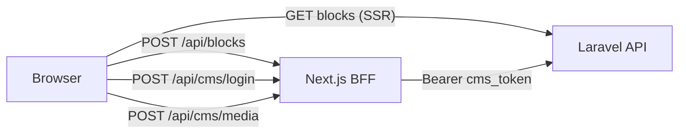

# CMS Blocks Sync — Frontend ↔ Laravel

This document mirrors the June 2026 Laravel CMS handoff. The frontend **never** writes to a local database — all CMS data flows through the Laravel API via a Next.js BFF layer.

## Architecture



| Operation | Public read | Staff write |
|-----------|-------------|-------------|
| Blocks | `GET /api/v1/blocks?relUrl=&locale=` from Server Components | `POST/DELETE /api/blocks` BFF → Laravel with Bearer |
| Auth | — | `POST /api/cms/login` → sets `cms_token` httpOnly cookie |
| Profile | — | `GET /api/cms/me` → `canEditCms` |
| Media | — | `POST /api/cms/media` BFF → `POST /api/v1/media` |

## Staff login

- **URL:** `http://localhost:3000/en/admin/login`
- **Demo admin:** `admin@niprealty.com` / `Admin123!`
- **Demo editor:** `advisor@niprealty.com` / `advisor-password`
- Footer link: **Staff login** → `/[locale]/admin/login`

After login, `CmsAuthProvider` calls `/api/cms/me`. When `canEditCms` is true, **Edit** buttons appear on wired blocks. A floating **Sign out** bar appears bottom-right.

## Block allowlist

Frontend registry: `lib/i18n/block-keys.ts`  
Backend registry: `config/cms-blocks.php` (Laravel)

**Rule:** Never POST a `(relUrl, blockKey)` pair that is not in both allowlists.

## relUrl convention

Locale-agnostic paths — no `/en` or `/ar` prefix:

| Page | relUrl |
|------|--------|
| Home | `/` |
| About | `/about` |
| Properties | `/properties` |
| Off-plan | `/off-plan` |
| Areas | `/areas` |
| Developers | `/developers` |
| Insights | `/insights` |
| FAQ | `/faq` |
| Legal | `/legal` |
| Contact | `/contact` |
| Private Office login | `/private-office` |
| Curated (member) | `/curated` |
| Thank you | `/thank-you` |
| 404 | `/404` |
| 500 | `/500` |
| Global footer | `/global` |

## Laravel endpoint map

| Laravel | Auth | Frontend caller |
|---------|------|-----------------|
| `GET /api/v1/blocks` | Public | `lib/api/blocks.ts` → `getBlocksForPage` |
| `POST /api/v1/blocks` | Bearer (admin/editor) | `app/api/blocks/route.ts` |
| `DELETE /api/v1/blocks` | Bearer (admin/editor) | `app/api/blocks/route.ts` |
| `POST /api/v1/auth/login` | Public | `app/api/cms/login/route.ts` |
| `GET /api/v1/auth/me` | Bearer | `app/api/cms/me/route.ts` |
| `POST /api/v1/auth/logout` | Bearer | `app/api/cms/logout/route.ts` |
| `POST /api/v1/media` | Bearer (admin/editor) | `app/api/cms/media/route.ts` |

## Response shapes

- **Blocks list:** plain array (no `{ data }` wrapper)
- **Single auth user:** may be wrapped as `{ data: user }` — frontend unwraps via `unwrapData()`
- **Media upload:** `{ url, id, ... }` — URL saved into block with `blockType: "IMAGE"`

## Adding a new editable block

1. Add key to `lib/i18n/block-keys.ts`
2. Add matching entry to Laravel `config/cms-blocks.php`
3. Wrap UI with `EditableText` or `EditableImage` using `relUrl` + `blockKey`
4. Run `npm run check`

## Bottom CTA band + footer copyright (June 2026)

Staff can edit the dark blue bottom CTA heading on catalog pages and the footer copyright line.

| relUrl | blockKey | blockType | Frontend component |
|--------|----------|-----------|-------------------|
| `/developers` | `cta-title` | TEXT | `EditableCtaBand` on `developers/page.tsx` |
| `/areas` | `cta-title` | TEXT | `EditableCtaBand` on `areas/page.tsx` |
| `/insights` | `cta-title` | TEXT | `EditableCtaBand` on `insights/[slug]/page.tsx` |
| `/global` | `footer-copyright` | TEXT | `Footer.tsx` |

**Already wired (confirm allowlist):**

| relUrl | blockKey |
|--------|----------|
| `/` | `home-cta-title`, `home-cta-desc` |
| `/faq` | `hero-eyebrow`, `hero-title`, `hero-description`, `cta-title`, `cta-description` |
| `/legal` | `hero-eyebrow`, `hero-title`, `hero-last-updated`, `sidebar-title`, `compliance-image`, `section-*-title`, `section-*-body` (7 sections) |
| `/global` | `footer-tagline`, `footer-newsletter-title`, `footer-newsletter-desc` |

**Optional Arabic seed (`locale=ar`):**

| relUrl | blockKey | Default Arabic copy |
|--------|----------|---------------------|
| `/developers` | `cta-title` | `تبحث عن المطور المناسب؟` |
| `/areas` | `cta-title` | `تفكر في الانتقال إلى دبي؟` |
| `/insights` | `cta-title` | `هل أنت مستعد لمناقشة خطوتك القادمة؟` |
| `/global` | `footer-copyright` | Match `footer.copyright` in `messages/ar.json` |

## What stays hardcoded / API-driven

- **FAQ accordion Q&A** — `GET /faqs?locale=` (Laravel admin FAQs); i18n JSON fallback when API empty
- Market pulse stats
- Contribute form backend
- Member Private Office data (curated items, advisor notes from member API)

## Environment

```env
NEXT_PUBLIC_API_URL=http://127.0.0.1:8000
```

Staff token is stored in the `cms_token` httpOnly cookie — never exposed to client JavaScript.
