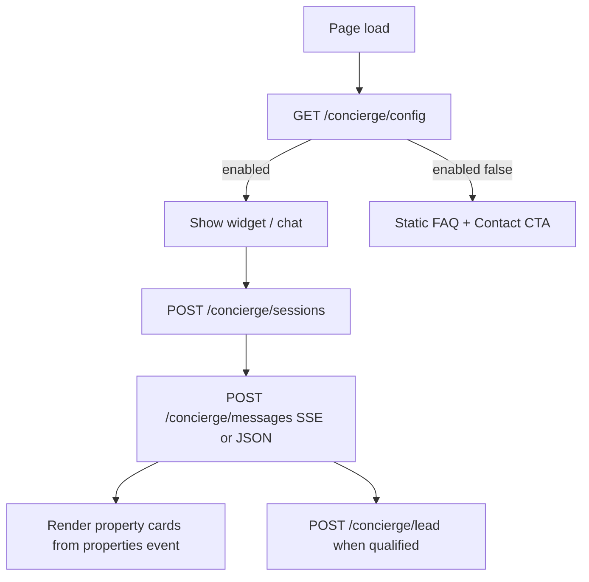

# NIP Reality — Frontend Integration: Search (Meilisearch) + AI Concierge

**Handoff for the Next.js frontend team.**  
Backend repo: `nip_reality_backend` · API base: `{NEXT_PUBLIC_API_URL}/api/v1`

**Status (June 2026 — ready for full integration)**

| Feature | Backend status | Frontend action |
|---------|----------------|-----------------|
| Property search with `keyword` | **Live** — Meilisearch when `keyword` is sent | Wire search page to `GET /properties` |
| Property filters (area, price, beds, etc.) | **Live** | Keep current filter UI |
| Concierge config / sessions | **Live** | Integrate widget + `/concierge` page |
| Concierge AI chat (Claude) | **Live** — Anthropic API key configured | **Full integration required** — SSE streaming, property cards, lead flow |
| Concierge lead capture | **Live** (Zoho via queue) | Wire lead form + consent |

> **Go-live:** Backend has Anthropic, Meilisearch, and all `/api/v1/concierge/*` endpoints ready. Frontend should implement **search + full concierge** (widget, `/concierge` page, SSE chat, property cards, leads). No feature flag or “wait for API key” — integrate everything now.

Related docs: [FRONTEND-API-INTEGRATION.md](./FRONTEND-API-INTEGRATION.md) (main API), [AI-CONCIERGE-SPEC.md](./AI-CONCIERGE-SPEC.md) (full product spec).

---

## Environment

### Frontend `.env.local`

```env
NEXT_PUBLIC_API_URL=http://nip_reality_backend.test
# Production: https://api.niprealty.com
```

No new frontend env vars for Meilisearch or Claude — those are backend-only.

### Backend CORS

Ensure your dev origin is allowed in backend `.env`:

```env
CORS_ALLOWED_ORIGINS=http://localhost:3000,https://niprealty.com
```

### Locale

Pass on every request:

- Query: `?locale=en` or `?locale=ar`
- Or header: `Accept-Language: en` / `ar`

Concierge bodies also accept `"locale": "en"` / `"ar"`.

---

## Part 1 — Property search (Meilisearch)

### What changed

`GET /api/v1/properties` is **unchanged for the frontend**. Same URL, same query params, same `PropertyResource` shape.

When the client sends a **`keyword`** query param, the backend searches via **Meilisearch** (typo-tolerant, relevance-ranked). Without `keyword`, listing uses the database with the same filters as before.

### Endpoint

```
GET /api/v1/properties
```

### Query parameters (all optional)

| Param | Type | Notes |
|-------|------|-------|
| `keyword` | string | **Triggers Meilisearch** — free-text search |
| `locale` | `en` \| `ar` | Resolved strings in response |
| `area` | string | Area **slug** (e.g. `dubai-marina`) |
| `developer` | string | Developer **slug** |
| `type` | string | Property type |
| `listing_type` | string | e.g. `sale`, `offplan` |
| `purpose` | string | e.g. `For Sale` |
| `bedrooms` or `beds` | int | |
| `bathrooms` or `baths` | int | |
| `price_min` or `min_price` | number | |
| `price_max` or `max_price` | number | |
| `price_range` | string | `AED 100k - 500k`, `AED 500k - 1M`, `AED 1M+` |
| `category` + `listing_type` | string | Used together for combined filter |
| `location` / `community` | string | Location text |
| `per_page` | int | Default `9`, max `50` |
| `page` | int | Pagination |

### Example

```
GET /api/v1/properties?keyword=marina&bedrooms=2&price_max=1500000&locale=en&per_page=12
```

### Response shape

Standard Laravel pagination:

```json
{
  "data": [
    {
      "id": 1,
      "title": "Marina View Apartment",
      "slug": "marina-view-apt",
      "description": "...",
      "type": "Apartment",
      "purpose": "For Sale",
      "location": "Dubai Marina",
      "listing_type": "sale",
      "bedrooms": 2,
      "bathrooms": 2,
      "area_sqft": 1200,
      "price": 1450000,
      "image_url": "https://...",
      "featured": false,
      "area": { "slug": "dubai-marina", "name": "Dubai Marina" },
      "developers": [],
      "facilities": [],
      "images": []
    }
  ],
  "links": { "first": "...", "last": "...", "prev": null, "next": "..." },
  "meta": { "current_page": 1, "per_page": 12, "total": 24 }
}
```

Use existing `PropertyCard` / list components — field names are **snake_case** (same as before).

### Search page implementation notes

1. Bind the search input to `keyword` — debounce 300–500ms, then refetch.
2. Keep facet filters (area, price, beds) as query params on the same request.
3. Do **not** call Meilisearch from the browser — only the Laravel API.
4. Empty `data` → show “no results” UI, not an error.
5. If the backend Meilisearch is down, API falls back to SQL `LIKE` automatically (slower, less fuzzy).

---

## Part 2 — AI Concierge

### Architecture (frontend view)



### Base path

All concierge routes are public (no auth required). Optional: send **member** Sanctum token if the user is logged into Private Office — backend attaches `user_id` for usage tracking.

```
Authorization: Bearer {memberToken}   // optional
```

---

### 2.1 `GET /api/v1/concierge/config`

Call on **every page load** (widget) and on `/concierge` page mount.

```
GET /api/v1/concierge/config?locale=en
```

**Response when AI is available:**

```json
{
  "enabled": true,
  "locale": "en",
  "disclaimer": "This is an AI assistant...",
  "greeting": "Hello — I'm the NIP Concierge...",
  "quickPrompts": [
    "Best areas for families",
    "Off-plan payment plans",
    "Golden Visa requirements",
    "Rental yields in Dubai Marina"
  ],
  "speakToAdvisorUrl": "/contact",
  "fallbackMode": false
}
```

**Response when disabled** (kill switch or daily spend cap only — not missing API key):

```json
{
  "enabled": false,
  "locale": "en",
  "disclaimer": "This is an AI assistant...",
  "greeting": null,
  "quickPrompts": [],
  "speakToAdvisorUrl": "/contact",
  "fallbackMode": true,
  "fallbackFaqs": [
    { "question": "How does NIP's Private Advisory work?", "answer": "..." }
  ]
}
```

**UI rules:**

| `enabled` | `fallbackMode` | What to render |
|-----------|----------------|----------------|
| `true` | `false` | Floating widget + full chat on `/concierge` |
| `false` | `true` | Hide widget launcher OR show minimal “Contact us” FAB; on `/concierge` show FAQ accordion + advisor CTA |
| `true` but chat errors | — | Show disclaimer + “Speak with an advisor” link; use i18n error strings below |

**Persistent disclaimer:** Always show `disclaimer` at the bottom of the chat panel (not dismissible).

---

### 2.2 `POST /api/v1/concierge/sessions`

Start a conversation when the user opens the widget or `/concierge` chat.

```
POST /api/v1/concierge/sessions
Content-Type: application/json
```

**Body:**

```json
{
  "locale": "en",
  "sourcePage": "/properties",
  "utmSource": "google",
  "utmCampaign": "summer2026",
  "visitorId": "optional-anonymous-fingerprint"
}
```

**Response `201`:**

```json
{
  "sessionId": "550e8400-e29b-41d4-a716-446655440000",
  "locale": "en",
  "greeting": "Hello — I'm the NIP Concierge...",
  "disclaimer": "This is an AI assistant...",
  "quickPrompts": ["Best areas for families", "..."],
  "leadCapture": {
    "status": "none",
    "missingFields": []
  }
}
```

Store `sessionId` in component state / `sessionStorage` for the tab session.

**Errors:**

| Status | Code | Action |
|--------|------|--------|
| `503` | `CONCIERGE_DISABLED` | Use `fallbackFaqs` from config; link to `/contact` |

**Rate limit:** 10 sessions per hour per IP.

---

### 2.3 `POST /api/v1/concierge/messages`

Send a user message; receive assistant reply.

**Prefer SSE for live typing effect.** Use JSON for simpler debugging.

#### Option A — SSE (recommended)

```
POST /api/v1/concierge/messages
Content-Type: application/json
Accept: text/event-stream
```

**Body:**

```json
{
  "sessionId": "550e8400-e29b-41d4-a716-446655440000",
  "message": "Show me 2-bedroom apartments in Dubai Marina under AED 1.5M",
  "locale": "en",
  "clientMessageId": "optional-uuid-for-retry-dedup"
}
```

**SSE events (in order):**

```
event: token
data: {"text": "Here are "}

event: token
data: {"text": "some options..."}

event: properties
data: {"items": [{ ...PropertyResource shape... }]}

event: leadCapture
data: {"status": "collecting", "missingFields": ["email", "name"], "prompt": "..."}

event: meta
data: {"messageId": "uuid", "model": "claude-sonnet-4-20250514", "intent": "property_search", "inputTokens": 1250, "outputTokens": 340, "costUsd": 0.0082, "isFallback": false, "refused": false}

event: done
data: {}
```

On failure:

```
event: error
data: {"code": "SESSION_NOT_FOUND", "message": "..."}

event: done
data: {}
```

**Browser SSE example:**

```typescript
async function sendConciergeMessage(sessionId: string, message: string, locale: string) {
  const res = await fetch(`${API_URL}/api/v1/concierge/messages`, {
    method: 'POST',
    headers: {
      'Content-Type': 'application/json',
      Accept: 'text/event-stream',
    },
    body: JSON.stringify({ sessionId, message, locale }),
  });

  const reader = res.body!.getReader();
  const decoder = new TextDecoder();
  let buffer = '';

  while (true) {
    const { done, value } = await reader.read();
    if (done) break;
    buffer += decoder.decode(value, { stream: true });

    const lines = buffer.split('\n');
    buffer = lines.pop() ?? '';

    let eventName = '';
    for (const line of lines) {
      if (line.startsWith('event:')) eventName = line.slice(6).trim();
      if (line.startsWith('data:') && eventName) {
        const data = JSON.parse(line.slice(5).trim());
        handleEvent(eventName, data); // token | properties | leadCapture | meta | error | done
        eventName = '';
      }
    }
  }
}
```

#### Option B — JSON fallback

```
POST /api/v1/concierge/messages
Accept: application/json
```

**Response `200`:**

```json
{
  "messageId": "uuid",
  "content": "Here are some options in Dubai Marina...",
  "properties": [{ "id": 1, "slug": "...", "title": "...", "price": 1450000 }],
  "leadCapture": { "status": "none", "missingFields": [] },
  "meta": {
    "model": "claude-sonnet-4-20250514",
    "intent": "property_search",
    "inputTokens": 1250,
    "outputTokens": 340,
    "costUsd": 0.0082,
    "isFallback": false,
    "refused": false
  }
}
```

**Property cards:** Render `properties` with the **same `PropertyCard`** as the search/listing page. Backend returns the same resource shape.

**Refusal** (no matching listings): `meta.refused === true`, `properties: []` — show assistant `content` and offer advisor CTA.

**Rate limit:** 30 messages per hour per IP.

---

### 2.4 `POST /api/v1/concierge/lead`

Submit when user provides name, email, consent (or when `leadCapture` indicates ready).

```
POST /api/v1/concierge/lead
Content-Type: application/json
```

**Body:**

```json
{
  "sessionId": "550e8400-e29b-41d4-a716-446655440000",
  "name": "John Smith",
  "email": "john@example.com",
  "phone": "+971501234567",
  "countryCode": "+971",
  "budgetRange": "1-3m",
  "timeline": "1-3-months",
  "preferredLanguage": "en",
  "consentMarketing": true
}
```

**Response `201`:**

```json
{
  "leadId": 42,
  "message": "Thank you. A NIP advisor will contact you within one business day."
}
```

**Errors:**

| Status | Code |
|--------|------|
| `409` | `LEAD_ALREADY_SUBMITTED` |
| `404` | `SESSION_NOT_FOUND` |
| `400` | `VALIDATION_ERROR` |

**Rate limit:** 5 per hour per IP.

---

## Part 3 — Full integration (required)

All concierge endpoints are **live** on dev/staging when pointed at a backend with Meilisearch indexed and Anthropic configured.

| Endpoint | Status |
|----------|--------|
| `GET /concierge/config` | Live |
| `POST /concierge/sessions` | Live |
| `POST /concierge/messages` | Live — Claude Haiku (intent) + Sonnet/Opus (reply), SSE + JSON |
| `POST /concierge/lead` | Live → Zoho via queue |
| `GET /properties?keyword=` | Live — Meilisearch |

### Implementation flow (required)

1. **Search page** — bind search input to `keyword` on `GET /properties`; keep all existing filters.
2. **On every public layout load** — `GET /concierge/config?locale=…`
3. **If `enabled === true`** — show floating widget (all public pages, not admin) and live chat on `/concierge`.
4. **On chat open** — `POST /concierge/sessions`; show `greeting`, `disclaimer`, `quickPrompts` as chips.
5. **On send** — `POST /concierge/messages` with **`Accept: text/event-stream`** (SSE):
   - Append `token` events to the assistant bubble (typing effect).
   - On `properties` — render cards with existing `PropertyCard` (same shape as search listings).
   - On `leadCapture` — prompt for missing fields; submit via `POST /concierge/lead` when ready.
   - On `meta` — optional dev logging (`intent`, `refused`, `isFallback`).
   - On `done` — enable input again.
6. **If `enabled === false`** (`fallbackMode: true`) — hide chat input; show `fallbackFaqs` + link to `/contact`.
7. **Optional member auth** — if user has Private Office token, send `Authorization: Bearer {token}` on concierge calls (usage tracking only).

### Expected chat behaviour (smoke-test these)

| User message | Expected UI |
|--------------|-------------|
| “2-bedroom apartments in Dubai Marina under 1.5M” | Streaming reply + **property cards** from real listings |
| Query with no matches | Reply text + `meta.refused: true` + advisor CTA (no invented listings) |
| “Connect me with an advisor” | `leadCapture` event → collect name/email/consent → `POST /lead` |
| Arabic message on `locale=ar` | Arabic reply text |

### Fallback handling (still required)

These are **operational** fallbacks, not “missing API key”:

- `503` / `CONCIERGE_DISABLED` → FAQ from config + `/contact`
- `meta.isFallback === true` → static FAQ text in assistant bubble (cap hit or API degraded)
- `429` / `RATE_LIMITED` → “Please wait before sending another message”
- Network / 500 → generic error + contact link (should be rare with key configured)

Do **not** use `NEXT_PUBLIC_CONCIERGE_ENABLED=false` — ship the widget and chat as part of this sprint.

---

## Part 4 — Suggested frontend file structure

```
lib/api/concierge.ts       # getConfig, startSession, sendMessage (SSE + JSON), submitLead
types/api/concierge.ts     # ConciergeConfig, Session, MessageMeta, LeadCapture, SseEvent
components/concierge/
  ConciergeWidget.tsx      # floating launcher (public layout, not admin)
  ConciergeChat.tsx        # messages, input, chips, disclaimer, property cards
  useConciergeChat.ts      # session state, SSE parser, lead state
```

### Types (TypeScript)

```typescript
export interface ConciergeConfig {
  enabled: boolean;
  locale: string;
  disclaimer: string;
  greeting: string | null;
  quickPrompts: string[];
  speakToAdvisorUrl: string;
  fallbackMode: boolean;
  fallbackFaqs?: { question: string; answer: string }[];
}

export interface ConciergeSession {
  sessionId: string;
  locale: string;
  greeting: string;
  disclaimer: string;
  quickPrompts: string[];
  leadCapture: LeadCaptureState;
}

export interface LeadCaptureState {
  status: 'none' | 'collecting' | 'qualified' | 'submitted';
  missingFields: string[];
  prompt?: string | null;
}

export interface ConciergeMessageMeta {
  messageId?: string;
  model?: string;
  intent?: string;
  inputTokens?: number;
  outputTokens?: number;
  costUsd?: number;
  isFallback?: boolean;
  refused?: boolean;
}
```

---

## Part 5 — UI / UX requirements

### Floating widget

- All **public** pages (not admin/CMS).
- Position: bottom-right (LTR), bottom-left (RTL / Arabic).
- Hidden when `config.enabled === false` (or minimal contact FAB).
- Click → open panel → `POST /sessions` if no `sessionId`.

### `/concierge` page

- Replace static mock messages with shared `ConciergeChat`.
- Keep hero/CMS blocks as-is.
- If `fallbackMode`, show FAQ accordion instead of chat.

### i18n keys to add (`messages/en.json`, `messages/ar.json`)

```json
{
  "concierge": {
    "launcherLabel": "Ask the Concierge",
    "disclaimer": "...",
    "speakToAdvisor": "Prefer a person? Speak with NIP",
    "typing": "Concierge is typing…",
    "errorGeneric": "Something went wrong. Please try again or contact an advisor.",
    "errorDisabled": "The Concierge is temporarily unavailable.",
    "leadConsent": "May we contact you about this inquiry?",
    "leadSubmitted": "Thank you. An advisor will be in touch shortly.",
    "sessionExpired": "Your session has expired. Starting a new conversation."
  }
}
```

Prefer API `disclaimer` / `greeting` / `quickPrompts` when `enabled`; use i18n only as fallback.

### RTL

- Pass `locale=ar` on all concierge calls when the site is in Arabic.
- Mirror widget position for RTL.

---

## Part 6 — Error envelope

Standard error shape:

```json
{
  "error": {
    "code": "CONCIERGE_DISABLED",
    "message": "Human-readable message",
    "details": []
  }
}
```

| Code | HTTP | Frontend handling |
|------|------|-------------------|
| `CONCIERGE_DISABLED` | 503 | FAQ fallback + `/contact` |
| `SESSION_NOT_FOUND` | 404 | Clear session, start new `POST /sessions` |
| `RATE_LIMITED` | 429 | Show “please wait” message |
| `LEAD_ALREADY_SUBMITTED` | 409 | Thank-you state, disable lead form |
| `VALIDATION_ERROR` | 400 | Show field errors |

---

## Part 7 — Integration checklist (complete all)

### Search (Meilisearch)

- [ ] Search input maps to `keyword` on `GET /properties`
- [ ] Filters (area, price, beds) on same request
- [ ] Pagination: `page` + `per_page`
- [ ] `locale` on every request
- [ ] Empty state when `data.length === 0`

### Concierge — full live integration

- [ ] `lib/api/concierge.ts` — `getConfig`, `startSession`, `sendMessage` (SSE), `sendMessageJson`, `submitLead`
- [ ] `types/api/concierge.ts` — types from Part 4
- [ ] `GET /concierge/config` on public layout load
- [ ] `ConciergeWidget` on all public pages (hidden when `enabled === false`)
- [ ] Shared `ConciergeChat` on widget + `/concierge` page (replace static mocks)
- [ ] `POST /sessions` on first open; persist `sessionId` in `sessionStorage`
- [ ] SSE parser: `token` → `properties` → `leadCapture` → `meta` → `done` (+ `error`)
- [ ] Property cards from `properties` event (reuse `PropertyCard`)
- [ ] Persistent `disclaimer` in chat panel
- [ ] Quick-prompt chips from config / session
- [ ] Lead capture UI + `consentMarketing` + `POST /concierge/lead`
- [ ] FAQ fallback when `fallbackMode === true`
- [ ] Error states: 503, 404 session, 429 rate limit
- [ ] RTL: widget bottom-left, `locale=ar` on all calls
- [ ] Optional: Bearer token for logged-in members

### Acceptance (before merge)

- [ ] Search: `keyword=marina` returns results when listings exist
- [ ] Config: `enabled: true` on dev API
- [ ] Chat: SSE tokens stream; property cards appear for property search
- [ ] Chat: refusal message when no listings match (no fake cards)
- [ ] Lead: submit succeeds; thank-you message shown
- [ ] `/concierge` page uses same component as widget

---

## Part 8 — Dev API URLs & smoke tests

Point `NEXT_PUBLIC_API_URL` at the backend environment (local or staging). Example local base: `http://nip_reality_backend.test` or whatever Laragon serves.

```
GET  {API}/api/v1/properties?keyword=apartment&locale=en
GET  {API}/api/v1/concierge/config?locale=en          → expect enabled: true
POST {API}/api/v1/concierge/sessions
POST {API}/api/v1/concierge/messages                   → Accept: text/event-stream
POST {API}/api/v1/concierge/lead
```

**Quick SSE test (browser console or curl):**

1. `POST /sessions` → copy `sessionId`
2. `POST /messages` with `Accept: text/event-stream` and a property question
3. Confirm `event: token` lines, then `event: properties` with `items[]`, then `event: done`

---

## Questions / backend contact

- Search empty → backend may need `scout:import "App\Models\Property"` on that environment.
- `enabled: false` → admin kill switch or daily AI cap hit (not API key).
- Chat errors → check backend logs; Anthropic key should be set in backend `.env` only (never in frontend).

**Backend handoff:** Kareem · [`CONCIERGE-LOCAL-TESTING.md`](./CONCIERGE-LOCAL-TESTING.md) for backend smoke tests · API in `routes/api.php`, `app/Http/Controllers/Api/Concierge/*`.
