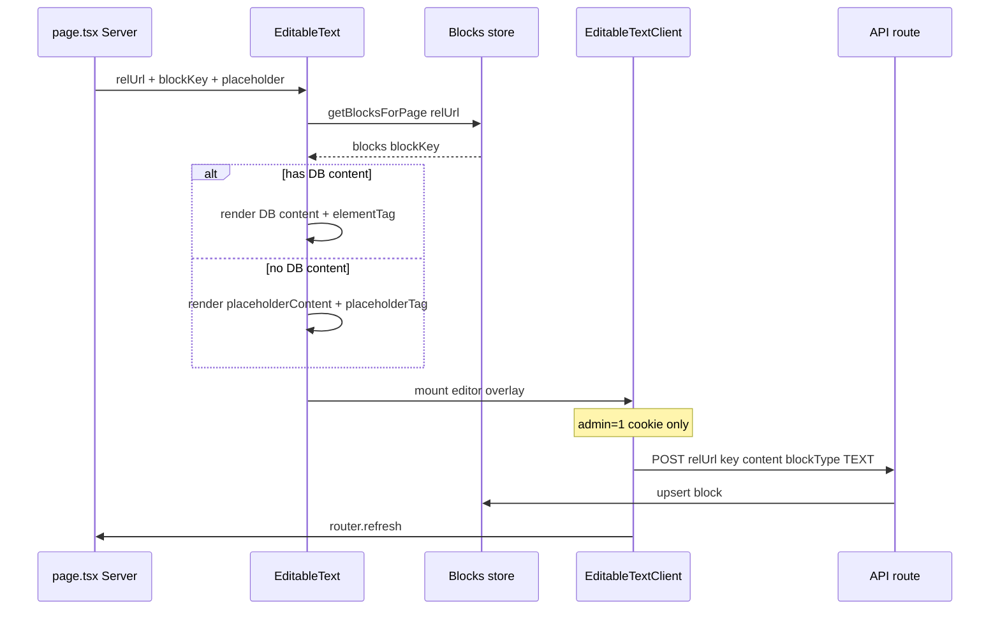

# Editable Page Sections — Reference Pattern

Documented from `c:\laragon\www\website`. NIP uses the **same UX pattern** with **backend API** instead of Prisma.

## Core idea

Every editable area on a page is identified by two keys:

| Key | Example | Purpose |
|-----|---------|---------|
| `relUrl` | `"/"`, `"/services/my-slug"` | Page path |
| `blockKey` | `"hero-title"`, `"intro-paragraph-1"` | Stable slot ID on that page |

Content is stored as **blocks** with types: `TEXT`, `IMAGE`, `VIDEO`, `HTML`.

Unique record: `(pageRelUrl, key)`.

## Reference data model (Block)

```
pageRelUrl   string   e.g. "/"
key          string   e.g. "hero-h1-1"
blockType    enum     TEXT | IMAGE | VIDEO | HTML
content      string   text body or media URL
elementTag   string?  HTML tag for TEXT blocks (h1, p, span, …)
```

## Reference components

| File | Role |
|------|------|
| `components/EditableText.tsx` | Server Component — loads block, renders tag + content |
| `components/EditableTextClient.tsx` | Client — edit modal, save/delete, `router.refresh()` |
| `components/EditableImage.tsx` | Server — `next/image` from block URL or placeholder |
| `components/EditableImageClient.tsx` | Client — media picker, save |
| `components/useIsAdmin.ts` | Client — true when `admin=1` cookie present |
| `components/EditableBlock.module.css` | Edit overlay styles |

## EditableText flow (reference)



### Server render logic (`EditableText.tsx`)

1. Fetch all blocks for `relUrl`.
2. Pick `blocks[blockKey]`.
3. If DB has content → use `content` + `elementTag` (valid HTML tag whitelist).
4. Else → use `placeholderContent` + `placeholderTag` (not persisted).
5. Render semantic tag (`h1`, `p`, etc.) with `EditableTextClient` as child for admin UI.

### Client edit logic (`EditableTextClient.tsx`)

1. `useIsAdmin()` — show edit affordance only when admin cookie set.
2. Open modal → edit text + tag selector.
3. **Save:** `POST` body:
   ```json
   { "relUrl": "/", "key": "hero-title", "content": "...", "blockType": "TEXT", "elementTag": "h1" }
   ```
4. **Delete:** `DELETE` body:
   ```json
   { "relUrl": "/", "key": "hero-title" }
   ```
5. Call `router.refresh()` so server re-renders with new data.

## EditableImage flow (reference)

1. Server loads block; `content` = image URL.
2. Renders `next/image` with URL or `placeholderUrl`.
3. Admin opens media library → select image → `POST` with `blockType: "IMAGE"`.
4. `router.refresh()`.

Reference media: UploadThing → `utfs.io` URLs stored in block `content`.

NIP: backend handles media upload/storage; frontend stores returned URL in block via API.

## Page usage (reference example)

From `app/services3/[slug]/page.tsx`:

```tsx
const relUrl = `/services3/${slug}`;

<EditableText
  relUrl={relUrl}
  blockKey="hero-title"
  placeholderContent="Service title"
  placeholderTag="h1"
  className="headline_1_1"
/>
<EditableImage
  relUrl={relUrl}
  blockKey="hero-image"
  placeholderUrl="/images/placeholder.jpg"
  placeholderAlt="Hero"
/>
```

**Convention:** one `relUrl` per page; many `blockKey`s per section (hero, intro, CTA, etc.).

## Reference API (website — Prisma)

| Method | Path | Body |
|--------|------|------|
| POST | `/api/blocks` | `{ relUrl, key, content, blockType, elementTag? }` |
| DELETE | `/api/blocks` | `{ relUrl, key }` |

Validated with Zod in `lib/validators.ts`. After write: `revalidateTag(tag.block(relUrl))`.

Cached read: `getBlocksForPageCached(relUrl)` → `Record<blockKey, { content, blockType, elementTag }>`.

## NIP Reality mapping (backend API)

Replace Prisma calls with backend endpoints (contract TBD with backend team):

| Operation | Suggested backend endpoint |
|-----------|---------------------------|
| List blocks for page | `GET /api/v1/blocks?relUrl=/about` |
| Upsert block | `POST /api/v1/blocks` |
| Delete block | `DELETE /api/v1/blocks` |
| Upload media | `POST /api/v1/media` → returns `{ url }` |

Frontend helpers (to implement in `lib/api/blocks.ts`):

```typescript
import { apiFetch } from "@/lib/api/client";

export type Block = {
  key: string;
  content: string;
  blockType: "TEXT" | "IMAGE" | "VIDEO" | "HTML";
  elementTag?: string | null;
};

export async function getBlocksForPage(relUrl: string) {
  const blocks = await apiFetch<Block[]>(`/api/v1/blocks`, {
    params: { relUrl },
  });
  return Object.fromEntries(blocks.map((b) => [b.key, b]));
}

export async function saveBlock(payload: {
  relUrl: string;
  key: string;
  content: string;
  blockType: string;
  elementTag?: string;
}) {
  return apiFetch("/api/v1/blocks", {
    method: "POST",
    body: JSON.stringify(payload),
  });
}
```

## Admin-only blocks

Reference supports `adminOnly` prop on `EditableText` — hidden from public unless `admin=1` cookie. Use for draft notes or internal labels.

## Implementation checklist for NIP

- [ ] Backend: blocks CRUD + media upload endpoints
- [ ] `lib/api/blocks.ts` helpers
- [ ] Port `EditableText`, `EditableTextClient`, `EditableImage`, `EditableImageClient`
- [ ] Port `useIsAdmin` (cookie name per backend auth)
- [ ] Add `EditableBlock.module.css` or Tailwind equivalents
- [ ] Per-page: define `relUrl`, wrap sections with stable `blockKey`s
- [ ] Admin login flow from backend (sets auth + admin cookies)

## blockKey naming conventions

Use descriptive, stable kebab-case tied to layout:

- `hero-title`, `hero-subheadline`, `hero-paragraph`
- `intro-paragraph-1`, `intro-paragraph-2`
- `section-who-thrives-title`, `cta-button-text`
- `hero-image`, `team-photo-1`

Never reuse keys across different `relUrl`s with different meaning; keys are unique **per page path**.
