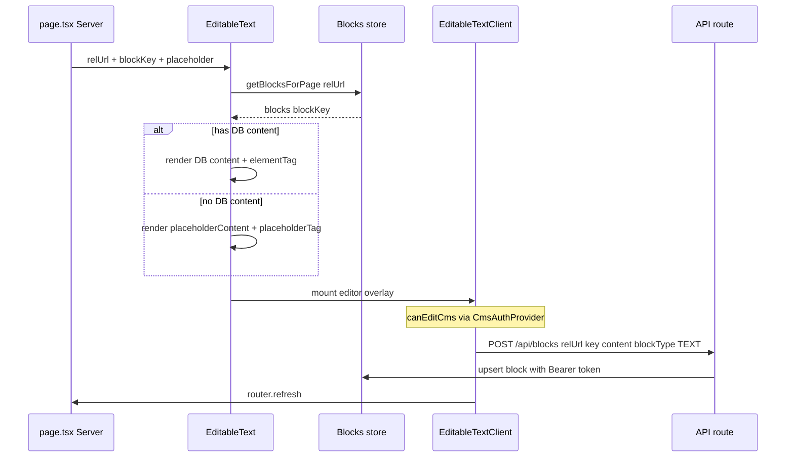

# Editable Page Sections — Reference Pattern

Documented from `c:\laragon\www\website`. NIP uses the **same UX pattern** with **backend API** instead of Prisma.

## Core idea

Every editable area on a page is identified by two keys:

| Key | Example | Purpose |
|-----|---------|---------|
| `relUrl` | `"/"`, `"/services/my-slug"` | Page path |
| `blockKey` | `"hero-title"`, `"intro-paragraph-1"` | Stable slot ID on that page |

Content is stored as **blocks** with types: `TEXT`, `IMAGE`, `VIDEO`, `HTML`.

Unique record: `(pageRelUrl, key)`.

## Reference data model (Block)

```
pageRelUrl   string   e.g. "/"
key          string   e.g. "hero-h1-1"
blockType    enum     TEXT | IMAGE | VIDEO | HTML
content      string   text body or media URL
elementTag   string?  HTML tag for TEXT blocks (h1, p, span, …)
```

## Reference components

| File | Role |
|------|------|
| `components/EditableText.tsx` | Server Component — loads block, renders tag + content |
| `components/EditableTextClient.tsx` | Client — edit modal, save/delete, `router.refresh()` |
| `components/EditableImage.tsx` | Server — `next/image` from block URL or placeholder |
| `components/EditableImageClient.tsx` | Client — media picker, save |
| `components/useIsAdmin.ts` | Client — wraps `useCanEditCms()` from `CmsAuthProvider` |
| `components/cms/CmsAuthProvider.tsx` | Client — fetches `/api/cms/me`, exposes `canEdit` |
| `components/cms/CmsStaffBar.tsx` | Client — floating “Editing as … / Sign out” bar |

## EditableText flow (reference)



### Server render logic (`EditableText.tsx`)

1. Fetch all blocks for `relUrl`.
2. Pick `blocks[blockKey]`.
3. If DB has content → use `content` + `elementTag` (valid HTML tag whitelist).
4. Else → use `placeholderContent` + `placeholderTag` (not persisted).
5. Render semantic tag (`h1`, `p`, etc.) with `EditableTextClient` as child for admin UI.

### Client edit logic (`EditableTextClient.tsx`)

1. `useCanEditCms()` — show edit affordance only when staff is logged in with `canEditCms`.
2. Open modal → edit text + tag selector.
3. **Save:** `POST /api/blocks` body:
   ```json
   { "relUrl": "/", "key": "hero-title", "content": "...", "blockType": "TEXT", "elementTag": "h1" }
   ```
4. **Delete:** `DELETE /api/blocks` body:
   ```json
   { "relUrl": "/", "key": "hero-title" }
   ```
5. Call `router.refresh()` so server re-renders with new data.

## EditableImage flow (reference)

1. Server loads block; `content` = image URL.
2. Renders `next/image` with URL or `placeholderUrl`.
3. Admin uploads image via `POST /api/cms/media` or pastes URL → `POST /api/blocks` with `blockType: "IMAGE"`.
4. `router.refresh()`.

Reference media: UploadThing → `utfs.io` URLs stored in block `content`.

NIP: backend handles media upload/storage; frontend stores returned URL in block via API.

## Page usage (reference example)

From `app/services3/[slug]/page.tsx`:

```tsx
const relUrl = `/services3/${slug}`;

<EditableText
  relUrl={relUrl}
  blockKey="hero-title"
  placeholderContent="Service title"
  placeholderTag="h1"
  className="headline_1_1"
/>
<EditableImage
  relUrl={relUrl}
  blockKey="hero-image"
  placeholderUrl="/images/placeholder.jpg"
  placeholderAlt="Hero"
/>
```

**Convention:** one `relUrl` per page; many `blockKey`s per section (hero, intro, CTA, etc.).

## Reference API (website — Prisma)

| Method | Path | Body |
|--------|------|------|
| POST | `/api/blocks` | `{ relUrl, key, content, blockType, elementTag? }` |
| DELETE | `/api/blocks` | `{ relUrl, key }` |

Validated with Zod in `lib/validators.ts`. After write: `revalidateTag(tag.block(relUrl))`.

Cached read: `getBlocksForPageCached(relUrl)` → `Record<blockKey, { content, blockType, elementTag }>`.

## NIP Reality mapping (live Laravel API + BFF)

See [CMS-BLOCKS-SYNC.md](./CMS-BLOCKS-SYNC.md) for the full endpoint map and allowlist sync.

| Operation | Frontend path |
|-----------|---------------|
| List blocks (public SSR) | `lib/api/blocks.ts` → `GET /api/v1/blocks?relUrl=&locale=` |
| Upsert block (staff) | Browser → `POST /api/blocks` BFF → Laravel with `cms_token` Bearer |
| Delete block (staff) | Browser → `DELETE /api/blocks` BFF → Laravel with Bearer |
| Staff login | `POST /api/cms/login` → sets `cms_token` httpOnly cookie |
| Staff profile | `GET /api/cms/me` → `canEditCms` |
| Upload media (staff) | `POST /api/cms/media` BFF → `POST /api/v1/media` |

**Staff login URL:** `/[locale]/admin/login` (footer link: “Staff login”)

**Demo credentials:** `admin@niprealty.com` / `Admin123!`

Block key registry: `lib/i18n/block-keys.ts` (must match Laravel `config/cms-blocks.php`).

## Admin-only blocks

Reference supports `adminOnly` prop on `EditableText` — hidden from public unless the `cms_token` staff cookie is present. Use for draft notes or internal labels.

## Implementation checklist for NIP

- [x] Backend: blocks CRUD + media upload endpoints (Laravel, June 2026)
- [x] `lib/api/blocks.ts` helpers
- [x] `EditableText`, `EditableTextClient`, `EditableImage`, `EditableImageClient`
- [x] `CmsAuthProvider` + staff login at `/admin/login`
- [x] BFF routes: `/api/blocks`, `/api/cms/login|logout|me|media`
- [x] Block keys wired on static pages (see `lib/i18n/block-keys.ts`)

## blockKey naming conventions

Use descriptive, stable kebab-case tied to layout:

- `hero-title`, `hero-subheadline`, `hero-paragraph`
- `intro-paragraph-1`, `intro-paragraph-2`
- `section-who-thrives-title`, `cta-button-text`
- `hero-image`, `team-photo-1`

Never reuse keys across different `relUrl`s with different meaning; keys are unique **per page path**.
