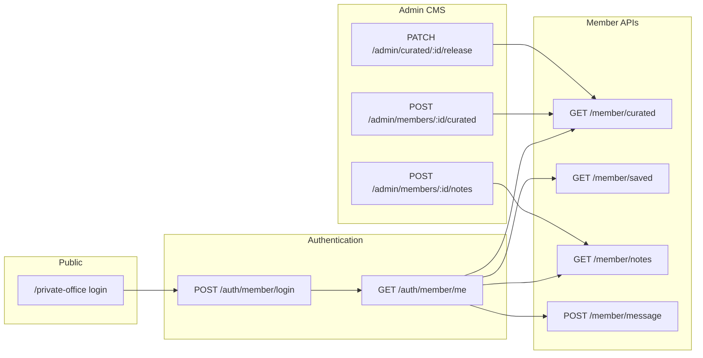

# NIP Reality — Private Office API Specification

Backend contract for the **Private Office** member area: login, curated selections, saved properties, advisor notes, and messaging. This feature is **not yet implemented** as REST endpoints — only the database tables are defined in [BACKEND-API-SPEC.md](./BACKEND-API-SPEC.md).

**Version:** 1.0  
**Last Updated:** June 2026  
**Status:** Proposed — backend must implement before frontend integration (Phase 6)  
**Related:** [BACKEND-API-SPEC.md](./BACKEND-API-SPEC.md) (main API spec)

---

## Table of Contents

1. [Overview](#overview)
2. [Current Gap](#current-gap)
3. [User Roles and Schema Extensions](#user-roles-and-schema-extensions)
4. [Frontend Pages (What Needs This API)](#frontend-pages-what-needs-this-api)
5. [Member Authentication API](#member-authentication-api)
6. [Member Data API](#member-data-api)
7. [Admin / Advisor API](#admin--advisor-api)
8. [Security and Business Rules](#security-and-business-rules)
9. [Error Responses](#error-responses)
10. [Frontend Integration Checklist](#frontend-integration-checklist)
11. [Backend Acceptance Criteria](#backend-acceptance-criteria)
12. [Example Requests (cURL)](#example-requests-curl)

---

## Overview

Private Office is an **invitation-only** member experience on the NIP Reality website. Members sign in to view:

- **Curated selections** — properties and off-plan projects hand-picked by their assigned advisor
- **Saved properties** — listings the member bookmarked for follow-up
- **Advisor notes** — private context explaining why items were included or excluded
- **Direct messaging** — send a question to their advisor from the dashboard

Access is gated. Public visitors see a login screen; members see personalized dashboards after authentication.



---

## Current Gap

The main backend spec defines **database tables** but **no REST endpoints** for Private Office.

| Area | In BACKEND-API-SPEC | REST endpoints |
|------|---------------------|----------------|
| `saved_properties` table | Yes (schema only) | **Missing** |
| `curated_selections` table | Yes (schema only) | **Missing** |
| `advisor_notes` table | Yes (schema only) | **Missing** |
| Member login / session | No | **Missing** |
| Message advisor | No (generic leads only) | **Missing** (member-specific) |

Admin authentication exists (`POST /api/v1/auth/login`) but is for CMS editors only — **not** for Private Office members.

---

## User Roles and Schema Extensions

### Existing `users` table

Currently documented roles: `admin`, `editor`, `viewer`.

### Required extension: `member` role

Private Office requires a **`member`** role (or a separate `members` table linked to `users`). Recommended approach: extend `users.role` enum:

| Role | Private Office access |
|------|----------------------|
| `member` | Login, read own curated/saved/notes, send messages |
| `admin` | Full CMS + manage all members |
| `editor` | CMS + manage assigned members only |
| `viewer` | CMS read-only, no Private Office admin |

### Recommended additional columns on `users`

| Column | Type | Description |
|--------|------|-------------|
| `assigned_advisor_id` | UUID, FK → users.id, NULL | Advisor assigned to this member |
| `invitation_status` | ENUM | `pending`, `active`, `suspended` |
| `salutation` | VARCHAR(50), NULL | e.g. "Mr.", "Ms." — used in welcome hero |
| `preferred_locale` | VARCHAR(10), DEFAULT 'en' | Default language for member UI |

Members with `invitation_status != 'active'` or `is_active = false` must receive `403` on login.

### Existing Private Office tables (reference)

These are already defined in [BACKEND-API-SPEC.md](./BACKEND-API-SPEC.md#database-schema):

**`saved_properties`** — `(user_id, property_id)` unique pair, `created_at`

**`curated_selections`** — advisor assigns property OR project to member; `is_released` controls visibility; optional `title`, `note`

**`advisor_notes`** — advisor writes titled notes visible to the member

---

## Frontend Pages (What Needs This API)

All routes are locale-prefixed (`/en/...`, `/ar/...`).

| Route | File | Data required |
|-------|------|---------------|
| `/private-office` | `app/[locale]/private-office/page.tsx` | Login form → `POST /auth/member/login` |
| `/private-office/member` | `app/[locale]/private-office/member/page.tsx` | Member profile, advisor info, curated preview (3), saved properties |
| `/curated` | `app/[locale]/curated/page.tsx` | Full curated list, advisor notes, message CTA |

**Current frontend state:** All member data is hardcoded in:

- `components/placeholders.ts` — `sampleAdvisorSelection`, `sampleProperties`
- `components/sections/CuratedStorySections.tsx` — `curatedAdvisorNotes` array
- `components/sections/PrivateOfficeMemberSections.tsx` — static "Sara N.", "Mr. Kamyar"

These placeholders must be replaced when backend delivers the endpoints below.

---

## Member Authentication API

Base path: `/api/v1/auth/member`

Uses the same JWT + HttpOnly cookie pattern as admin auth. Member tokens must **not** grant CMS edit access.

---

### POST `/api/v1/auth/member/login`

Member sign-in from the Private Office login page.

**Request Body:**

```json
{
  "email": "member@example.com",
  "password": "secret"
}
```

**Response:** `200 OK`

```json
{
  "token": "jwt-token-here",
  "user": {
    "id": "550e8400-e29b-41d4-a716-446655440000",
    "email": "member@example.com",
    "name": "Kamyar",
    "salutation": "Mr.",
    "displayName": "Mr. Kamyar",
    "role": "member",
    "preferredLocale": "en",
    "advisor": {
      "id": "660e8400-e29b-41d4-a716-446655440001",
      "name": "Sara N.",
      "email": "sara@niprealty.com",
      "availability": "Mon–Fri | Responds within hours"
    }
  },
  "expiresAt": "2026-06-14T10:00:00Z"
}
```

**Cookies Set:**

| Cookie | Value | Notes |
|--------|-------|-------|
| `auth_token` | JWT | HttpOnly, Secure, SameSite=Lax |
| `member` | `"1"` | Allows frontend to show member UI without decoding JWT |

**Errors:**

| Status | Code | When |
|--------|------|------|
| 401 | `INVALID_CREDENTIALS` | Wrong email or password |
| 403 | `ACCOUNT_INACTIVE` | `is_active = false` |
| 403 | `INVITATION_PENDING` | Member not yet activated |
| 403 | `NOT_A_MEMBER` | User exists but role is not `member` |

---

### POST `/api/v1/auth/member/logout`

End member session and clear cookies.

**Headers:**

- `Authorization: Bearer <token>`

**Response:** `204 No Content`

Clears `auth_token` and `member` cookies.

---

### GET `/api/v1/auth/member/me`

Get current authenticated member profile. Used on page load for hero personalization and advisor bar.

**Headers:**

- `Authorization: Bearer <token>`

**Response:** `200 OK`

```json
{
  "id": "550e8400-e29b-41d4-a716-446655440000",
  "email": "member@example.com",
  "name": "Kamyar",
  "salutation": "Mr.",
  "displayName": "Mr. Kamyar",
  "role": "member",
  "preferredLocale": "en",
  "advisor": {
    "id": "660e8400-e29b-41d4-a716-446655440001",
    "name": "Sara N.",
    "email": "sara@niprealty.com",
    "availability": "Mon–Fri | Responds within hours"
  }
}
```

**Errors:**

| Status | Code | When |
|--------|------|------|
| 401 | `UNAUTHORIZED` | Missing or expired token |
| 403 | `FORBIDDEN` | Token belongs to admin, not member |

---

### POST `/api/v1/auth/member/forgot-password` (optional)

Password reset request. Frontend currently links to contact — implement when email infrastructure is ready.

**Request Body:**

```json
{
  "email": "member@example.com"
}
```

**Response:** `200 OK` (always, to avoid email enumeration)

```json
{
  "message": "If an account exists, reset instructions have been sent."
}
```

---

## Member Data API

Base path: `/api/v1/member`

**All endpoints require:**

- `Authorization: Bearer <token>`
- Authenticated user with `role = member`
- Data scoped to `user_id = currentUser.id` only

**Common query parameter:**

| Param | Type | Required | Description |
|-------|------|----------|-------------|
| `locale` | string | No | Content language (`en`, `ar`). Default: member's `preferredLocale` or `en` |

Localized fields (`title`, `name`, etc.) resolve from JSON columns on linked property/project records using the same rules as [Properties API](./BACKEND-API-SPEC.md#properties-api) and [Off-Plan API](./BACKEND-API-SPEC.md#off-plan-projects-api).

---

### GET `/api/v1/member/curated`

List released curated selections for the logged-in member.

**Query Parameters:**

| Param | Type | Default | Description |
|-------|------|---------|-------------|
| `locale` | string | `en` | Resolve property/project titles |
| `page` | integer | `1` | Page number |
| `limit` | integer | `12` | Items per page |

**Source query:** `curated_selections` WHERE `user_id = :currentUser` AND `is_released = true` ORDER BY `released_at DESC`

**Response:** `200 OK`

```json
{
  "items": [
    {
      "id": "770e8400-e29b-41d4-a716-446655440002",
      "title": "Palm Jumeirah Residence",
      "note": "Pre-launch access secured. Direct frontage and a layout that holds long-term resale strength.",
      "releasedAt": "2026-05-22T10:00:00Z",
      "type": "property",
      "property": {
        "id": "880e8400-e29b-41d4-a716-446655440003",
        "slug": "palm-jumeirah-villa",
        "title": "Luxury Palm Villa",
        "propertyType": "villa",
        "listingType": "sale",
        "price": 15000000,
        "currency": "AED",
        "bedrooms": 5,
        "bathrooms": 6,
        "areaSqft": 8500,
        "location": "Palm Jumeirah, Dubai",
        "primaryImage": "https://cdn.niprealty.com/properties/palm-villa.jpg",
        "isAvailable": true
      },
      "project": null,
      "advisor": {
        "id": "660e8400-e29b-41d4-a716-446655440001",
        "name": "Sara N."
      }
    },
    {
      "id": "770e8400-e29b-41d4-a716-446655440004",
      "title": "Creek Harbour Project",
      "note": "Handover Q3 next year, payment plan back-weighted at 60/40.",
      "releasedAt": "2026-05-18T14:30:00Z",
      "type": "project",
      "property": null,
      "project": {
        "id": "990e8400-e29b-41d4-a716-446655440005",
        "slug": "creek-harbour-tower",
        "name": "Creek Harbour Tower",
        "startingPrice": 3200000,
        "currency": "AED",
        "handoverQuarter": "Q3 2027",
        "status": "selling",
        "primaryImage": "https://cdn.niprealty.com/offplan/creek-harbour.jpg",
        "developer": {
          "slug": "emaar",
          "name": "Emaar"
        },
        "area": {
          "slug": "dubai-creek-harbour",
          "name": "Dubai Creek Harbour"
        },
        "isAvailable": true
      },
      "advisor": {
        "id": "660e8400-e29b-41d4-a716-446655440001",
        "name": "Sara N."
      }
    }
  ],
  "total": 6,
  "page": 1,
  "totalPages": 1
}
```

**Field rules:**

- `type` is `"property"` when `property_id` is set, `"project"` when `project_id` is set
- Exactly one of `property` or `project` is populated; the other is `null`
- `title` on the selection may override the listing title for display in `AdvisorCard`
- `note` maps to card excerpt / advisor context
- Unreleased selections (`is_released = false`) must **never** appear in this response
- If linked property/project is sold or draft, return `isAvailable: false` but still include the item (advisor may add context in `note`)

**Frontend usage:**

- Member dashboard: first 3 items (`limit=3`)
- Curated page: full list

---

### GET `/api/v1/member/saved`

List properties saved by the logged-in member.

**Query Parameters:**

| Param | Type | Default | Description |
|-------|------|---------|-------------|
| `locale` | string | `en` | Resolve property titles |
| `page` | integer | `1` | Page number |
| `limit` | integer | `12` | Items per page |

**Source query:** `saved_properties` JOIN `properties` WHERE `user_id = :currentUser` ORDER BY `saved_properties.created_at DESC`

**Response:** `200 OK`

```json
{
  "items": [
    {
      "savedAt": "2026-05-10T09:15:00Z",
      "property": {
        "id": "880e8400-e29b-41d4-a716-446655440003",
        "slug": "palm-jumeirah-villa",
        "title": "Luxury Palm Villa",
        "propertyType": "villa",
        "listingType": "sale",
        "price": 15000000,
        "currency": "AED",
        "bedrooms": 5,
        "bathrooms": 6,
        "areaSqft": 8500,
        "location": "Palm Jumeirah, Dubai",
        "area": {
          "slug": "palm-jumeirah",
          "name": "Palm Jumeirah"
        },
        "primaryImage": "https://cdn.niprealty.com/properties/palm-villa.jpg",
        "isFeatured": true,
        "isExclusive": false,
        "isAvailable": true
      }
    }
  ],
  "total": 3,
  "page": 1,
  "totalPages": 1
}
```

Property object shape matches `GET /api/v1/properties` list items, plus wrapper `savedAt`.

**Frontend usage:** `PrivateOfficeMemberSavedSection` → `PropertyCard` grid

---

### POST `/api/v1/member/saved`

Save a property to the member's list. Called from property detail pages when member clicks "Save".

**Request Body:**

```json
{
  "propertyId": "880e8400-e29b-41d4-a716-446655440003"
}
```

**Response:** `201 Created`

```json
{
  "id": "aa0e8400-e29b-41d4-a716-446655440006",
  "propertyId": "880e8400-e29b-41d4-a716-446655440003",
  "savedAt": "2026-06-13T12:00:00Z"
}
```

**Errors:**

| Status | Code | When |
|--------|------|------|
| 404 | `NOT_FOUND` | Property does not exist |
| 409 | `ALREADY_SAVED` | Duplicate `(user_id, property_id)` |

---

### DELETE `/api/v1/member/saved/:propertyId`

Remove a saved property.

**Response:** `204 No Content`

**Errors:**

| Status | Code | When |
|--------|------|------|
| 404 | `NOT_FOUND` | Property not in member's saved list |

---

### GET `/api/v1/member/notes`

List advisor notes for the logged-in member.

**Query Parameters:**

| Param | Type | Default | Description |
|-------|------|---------|-------------|
| `locale` | string | `en` | Reserved for future localized note content |
| `page` | integer | `1` | Page number |
| `limit` | integer | `20` | Items per page |

**Source query:** `advisor_notes` WHERE `user_id = :currentUser` ORDER BY `created_at DESC`

**Response:** `200 OK`

```json
{
  "items": [
    {
      "id": "bb0e8400-e29b-41d4-a716-446655440007",
      "title": "Why this Palm Jumeirah residence",
      "content": "Pre-launch access secured. Direct frontage and a layout that holds long-term resale strength. Pricing in line with comparable releases — I would not extend beyond the next two phases.",
      "createdAt": "2026-05-22T10:00:00Z",
      "advisor": {
        "id": "660e8400-e29b-41d4-a716-446655440001",
        "name": "Sara N."
      }
    },
    {
      "id": "bb0e8400-e29b-41d4-a716-446655440008",
      "title": "Excluded from view",
      "content": "Two off-plan launches in Business Bay were considered and set aside. Build quality concerns based on developer's recent deliveries.",
      "createdAt": "2026-05-15T08:00:00Z",
      "advisor": {
        "id": "660e8400-e29b-41d4-a716-446655440001",
        "name": "Sara N."
      }
    }
  ],
  "total": 3,
  "page": 1,
  "totalPages": 1
}
```

**Frontend usage:** `CuratedNotesSection` — displays `title`, formatted `createdAt` as date, `content` as body

---

### POST `/api/v1/member/message`

Send a message to the member's assigned advisor. Replaces the current "Message your Advisor" link to `/contact`.

**Request Body:**

```json
{
  "subject": "Question on curated selection",
  "message": "Can we arrange a private viewing for the Palm residence?",
  "locale": "en",
  "relatedPropertyId": "880e8400-e29b-41d4-a716-446655440003",
  "relatedProjectId": null,
  "relatedCuratedId": "770e8400-e29b-41d4-a716-446655440002"
}
```

| Field | Type | Required | Description |
|-------|------|----------|-------------|
| `subject` | string | Yes | Short subject line (max 255) |
| `message` | string | Yes | Message body |
| `locale` | string | No | Member's language for confirmation text |
| `relatedPropertyId` | UUID | No | Link message to a property |
| `relatedProjectId` | UUID | No | Link message to an off-plan project |
| `relatedCuratedId` | UUID | No | Link message to a curated selection |

**Backend behavior:**

1. Validate member has an assigned advisor
2. Create a lead record (recommended: reuse `leads` table with `leadType: "member_message"`)
3. Set `assigned_to` = member's `assigned_advisor_id`
4. Pre-fill member name and email from authenticated user
5. Notify advisor (email/CRM — out of scope for this spec)

**Response:** `201 Created`

```json
{
  "id": "cc0e8400-e29b-41d4-a716-446655440009",
  "message": "Your message has been sent. Sara typically responds within hours."
}
```

Confirmation `message` should be localized when `locale=ar`.

**Errors:**

| Status | Code | When |
|--------|------|------|
| 400 | `VALIDATION_ERROR` | Missing subject or message |
| 403 | `NO_ADVISOR_ASSIGNED` | Member has no assigned advisor |

---

## Admin / Advisor API

These endpoints power the **admin CMS** side — how advisors create and release content members see. Auth: `admin` or `editor` role. Editors should only access members where they are the assigned advisor.

Base path: `/api/v1/admin`

---

### POST `/api/v1/admin/members`

Create or invite a Private Office member.

**Request Body:**

```json
{
  "email": "newmember@example.com",
  "name": "Kamyar",
  "salutation": "Mr.",
  "password": "temporary-password",
  "assignedAdvisorId": "660e8400-e29b-41d4-a716-446655440001",
  "preferredLocale": "en",
  "invitationStatus": "active"
}
```

**Response:** `201 Created`

```json
{
  "id": "550e8400-e29b-41d4-a716-446655440000",
  "email": "newmember@example.com",
  "name": "Kamyar",
  "role": "member",
  "invitationStatus": "active"
}
```

---

### GET `/api/v1/admin/members/:memberId/curated`

List all curated selections for a member (including unreleased). For advisor dashboard.

**Response:** Same shape as member curated list, plus `isReleased` and `releasedAt` on each item.

---

### POST `/api/v1/admin/members/:memberId/curated`

Add a curated selection for a member.

**Request Body:**

```json
{
  "propertyId": "880e8400-e29b-41d4-a716-446655440003",
  "projectId": null,
  "title": "Palm Jumeirah Residence",
  "note": "Pre-launch access secured.",
  "releaseImmediately": false
}
```

Either `propertyId` or `projectId` must be set, not both.

**Response:** `201 Created`

---

### PATCH `/api/v1/admin/curated/:curatedId/release`

Release a curated selection to the member.

**Request Body:**

```json
{
  "isReleased": true
}
```

When `isReleased` becomes `true`, set `released_at = NOW()`.

**Response:** `200 OK`

---

### DELETE `/api/v1/admin/curated/:curatedId`

Remove a curated selection.

**Response:** `204 No Content`

---

### POST `/api/v1/admin/members/:memberId/notes`

Create an advisor note for a member.

**Request Body:**

```json
{
  "title": "Why this Palm Jumeirah residence",
  "content": "Pre-launch access secured. Direct frontage..."
}
```

**Response:** `201 Created`

---

### DELETE `/api/v1/admin/notes/:noteId`

Delete an advisor note.

**Response:** `204 No Content`

---

## Security and Business Rules

### Data isolation

- Every member query MUST filter by `user_id = authenticatedMember.id`
- Attempting to access another member's data via ID manipulation returns `403 FORBIDDEN`
- Admin endpoints validate advisor assignment for `editor` role

### Curated visibility

- Members see only `is_released = true` selections
- Releasing is a deliberate advisor action — unreleased items are drafts

### Authentication separation

- Member JWT must not set `admin=1` cookie
- Admin JWT must not access `/api/v1/member/*` endpoints (use admin routes instead)
- Token payload should include `role` claim for authorization middleware

### Property availability

- Saved/curated items referencing sold or draft properties remain visible with `isAvailable: false`
- Frontend may show a subtle "No longer available" badge

### Rate limiting

Align with main spec:

- Login: 10 attempts/minute per IP
- Member read endpoints: 500 requests/minute per user
- Message endpoint: 10 messages/hour per member

### CORS and cookies

Same as [BACKEND-API-SPEC.md — CORS Configuration](./BACKEND-API-SPEC.md#cors-configuration):

- `http://localhost:3000` (development)
- Production domains with credentials enabled

---

## Error Responses

Uses the same envelope as the main spec:

```json
{
  "error": {
    "code": "FORBIDDEN",
    "message": "You do not have access to this resource",
    "details": []
  }
}
```

**Private Office-specific error codes:**

| Code | HTTP | Description |
|------|------|-------------|
| `INVALID_CREDENTIALS` | 401 | Wrong email/password on member login |
| `NOT_A_MEMBER` | 403 | User role is not member |
| `ACCOUNT_INACTIVE` | 403 | Account disabled |
| `INVITATION_PENDING` | 403 | Member not yet activated |
| `NO_ADVISOR_ASSIGNED` | 403 | Cannot send message without advisor |
| `ALREADY_SAVED` | 409 | Property already in saved list |

---

## Frontend Integration Checklist

When backend endpoints are live, the frontend team (Jimmy) will:

### 1. API helpers

Create:

- `lib/api/auth.ts` — `loginMember`, `logoutMember`, `getMemberMe`
- `lib/api/member.ts` — `getCurated`, `getSaved`, `saveProperty`, `unsaveProperty`, `getNotes`, `sendMessage`
- `types/api/member.ts` — TypeScript interfaces matching response shapes above

### 2. Login page

File: `app/[locale]/private-office/page.tsx`

- Wire form submit to `POST /auth/member/login`
- On success: redirect to `/[locale]/private-office/member`
- On error: show inline error message
- Localize "Request access" / "Forgot password?" links

### 3. Route protection

- `/private-office/member` and `/curated` require authenticated member
- Unauthenticated → redirect to `/private-office`
- Use middleware or server-side session check

### 4. Member dashboard

File: `components/sections/PrivateOfficeMemberSections.tsx`

| Section | Replace | With |
|---------|---------|------|
| Hero welcome | Hardcoded "Mr. Kamyar" | `GET /auth/member/me` → `displayName` |
| Advisor bar | Hardcoded "Sara N." | `user.advisor` from `/me` |
| Curated preview | `sampleAdvisorSelection` | `GET /member/curated?limit=3` |
| Saved properties | `sampleProperties` | `GET /member/saved` |

### 5. Curated page

File: `components/sections/CuratedStorySections.tsx`

| Section | Replace | With |
|---------|---------|------|
| Hero advisor | Hardcoded name | `GET /auth/member/me` |
| Selection grid | `sampleAdvisorSelection` | `GET /member/curated` |
| Notes list | `curatedAdvisorNotes` export | `GET /member/notes` |
| Message CTA | Link to `/contact` | Modal or form → `POST /member/message` |

### 6. Property detail (future)

- Add "Save" button for logged-in members → `POST /member/saved`
- Toggle unsave → `DELETE /member/saved/:propertyId`

### 7. Environment

Requires `NEXT_PUBLIC_API_URL` pointing to backend with CORS + cookies configured.

---

## Backend Acceptance Criteria

Backend is ready for frontend integration when all of the following pass:

- [ ] Member can log in with valid credentials and receives JWT + cookies
- [ ] Invalid login returns `401`, inactive account returns `403`
- [ ] Admin credentials cannot access `GET /member/curated` (returns `403`)
- [ ] Member A cannot see Member B's curated, saved, or notes data
- [ ] Unreleased curated selections do not appear in member API
- [ ] Releasing a selection makes it visible on next `GET /member/curated`
- [ ] `locale=ar` returns Arabic property/project titles where available
- [ ] `POST /member/message` creates a lead assigned to the member's advisor
- [ ] `POST /member/saved` and `DELETE /member/saved/:id` work with duplicate protection
- [ ] All responses match JSON shapes in this document
- [ ] CORS allows `http://localhost:3000` with credentials for local dev

---

## Example Requests (cURL)

### Member login

```bash
curl -X POST https://api.niprealty.com/api/v1/auth/member/login \
  -H "Content-Type: application/json" \
  -d '{"email":"member@example.com","password":"secret"}' \
  -c cookies.txt
```

### Get curated selections

```bash
curl https://api.niprealty.com/api/v1/member/curated?locale=en \
  -H "Authorization: Bearer YOUR_JWT_TOKEN"
```

### Get saved properties

```bash
curl https://api.niprealty.com/api/v1/member/saved?locale=en \
  -H "Authorization: Bearer YOUR_JWT_TOKEN"
```

### Get advisor notes

```bash
curl https://api.niprealty.com/api/v1/member/notes?locale=en \
  -H "Authorization: Bearer YOUR_JWT_TOKEN"
```

### Message advisor

```bash
curl -X POST https://api.niprealty.com/api/v1/member/message \
  -H "Authorization: Bearer YOUR_JWT_TOKEN" \
  -H "Content-Type: application/json" \
  -d '{
    "subject": "Viewing request",
    "message": "Can we arrange a private viewing?",
    "locale": "en",
    "relatedCuratedId": "770e8400-e29b-41d4-a716-446655440002"
  }'
```

### Save a property

```bash
curl -X POST https://api.niprealty.com/api/v1/member/saved \
  -H "Authorization: Bearer YOUR_JWT_TOKEN" \
  -H "Content-Type: application/json" \
  -d '{"propertyId":"880e8400-e29b-41d4-a716-446655440003"}'
```

---

## Implementation Priority

| Priority | Endpoint | Blocks |
|----------|----------|--------|
| P0 | `POST /auth/member/login` | Any member page |
| P0 | `GET /auth/member/me` | Hero personalization |
| P0 | `GET /member/curated` | Dashboard + curated page |
| P1 | `GET /member/notes` | Curated page notes section |
| P1 | `GET /member/saved` | Dashboard saved section |
| P1 | `POST /member/message` | Advisor messaging |
| P2 | `POST/DELETE /member/saved` | Save from property pages |
| P2 | Admin curated/notes CRUD | Advisor workflow in CMS |

---

*This document should be updated when endpoints are implemented. Mark sections as **Implemented** and link to OpenAPI/Swagger when available.*
